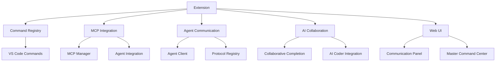

# The New Fuse VS Code Extension

## Overview

The New Fuse VS Code extension is an advanced AI assistant with a Copilot-like chat interface for coding, workflow automation, and agent coordination. It provides a seamless experience for developers to work with multiple AI agents, coordinate their activities, and create complex workflows.

## Features

### Multiple Operational Modes

The New Fuse offers five specialized operational modes, each tailored to different development needs:

- **Orchestrator Mode**: Coordinates multiple AI agents working together on complex tasks
- **Debug Mode**: Provides detailed inspection of agent-to-agent message traffic and tool execution
- **Ask Mode**: Offers a simplified interface for direct queries to specific agents
- **Architect Mode**: Specialized for system design and planning tasks
- **Code Mode**: Focused on code generation, refactoring, and optimization

### Inter-AI Communication

- **Multiple Communication Protocols**:
  - Workspace State Protocol: For extensions in the same VS Code window
  - File Protocol: For cross-window and cross-session communication
  - Command Protocol: For direct, synchronous messaging
  - Message Control Protocol (MCP): For standardized AI agent interactions
- **AI Collaboration**: Coordinate multiple AI agents to work together on tasks
- **Collaborative Code Completion**: Combine suggestions from multiple sources
- **Master Command Center**: Unified interface to control all AI communication
- **Agent Adapters**: Support for various AI agents (GitHub Copilot, Claude, etc.)

## Architecture

The VS Code extension is built on a modular architecture that enables seamless communication between different AI agents and tools:



## Installation

1. Clone the repository

2. Navigate to the VS Code extension directory:

   ```bash
   cd src/vscode-extension
   ```

3. Install dependencies:

   ```bash
   npm install
   ```

4. Build the extension:

   ```bash
   npm run build
   ```

5. Launch VS Code with the extension:

   ```bash
   ./launch-vscode.sh
   ```

## Commands

All commands can be accessed via the Command Palette (Cmd+Shift+P or Ctrl+Shift+P):

### Mode Commands

| Command | Description |
|---------|-------------|
| `thefuse.selectMode` | Select operational mode |
| `thefuse.mode.orchestrator` | Switch to Orchestrator mode |
| `thefuse.mode.debug` | Switch to Debug mode |
| `thefuse.mode.ask` | Switch to Ask mode |
| `thefuse.mode.architect` | Switch to Architect mode |
| `thefuse.mode.code` | Switch to Code mode |

### Core Commands

| Command | Description |
|---------|-------------|
| `thefuse.helloWorld` | Basic hello world test |
| `thefuse.openDashboard` | Open The New Fuse Dashboard |
| `thefuse.openChat` | Open The New Fuse Chat |
| `thefuse.openChatPanel` | Open The New Fuse Chat in Panel |
| `thefuse.startNewChat` | Start a new chat session |
| `thefuse.clearChat` | Clear the current chat |
| `thefuse.openSettings` | Open The New Fuse Settings |
| `thefuse.openWorkflowBuilder` | Open Workflow Builder |

### MCP Commands

| Command | Description |
|---------|-------------|
| `thefuse.mcp.initialize` | Initialize MCP Integration |
| `thefuse.mcp.showTools` | Show MCP Tools |
| `thefuse.mcp.testTool` | Test a specific MCP Tool |
| `thefuse.mcp.askAgent` | Ask Agent a question using MCP Tools |
| `thefuse.mcp.browseMarketplace` | Browse MCP Server Marketplace |
| `thefuse.mcp.addServerFromMarketplace` | Add MCP Server from Marketplace |
| `thefuse.openMcpCommandPalette` | Open MCP Command Palette |

### Code Analysis Commands

| Command | Description |
|---------|-------------|
| `thefuse.analyzeCodeProblem` | Analyze Code Problem |
| `thefuse.startIterativeAnalysis` | Start Iterative Code Analysis |
| `thefuse.continueIteration` | Continue Analysis Iteration |
| `thefuse.exportAnalysisReport` | Export Analysis Report |

### Anthropic XML Commands

| Command | Description |
|---------|-------------|
| `thefuse.anthropic.parseXmlFunctionCall` | Parse Anthropic XML Function Call |
| `thefuse.anthropic.createXmlFunctionCall` | Create Anthropic XML Function Call |
| `thefuse.anthropic.convertToolToXmlFormat` | Convert Tool to Anthropic XML Format |
| `thefuse.anthropic.convertSelectionToXmlFunctionCall` | Convert Selection to Anthropic XML Function Call |

## Communication Protocols

The VS Code extension supports multiple communication protocols:

### Workspace State Protocol

The Workspace State Protocol enables communication between extensions in the same VS Code window:

```typescript
interface WorkspaceStateTransport implements TransportMethod {
  id: string = 'workspace-state';

  async send(message: AgentMessage): Promise<boolean> {
    // Implementation
  }

  receive(callback: (message: AgentMessage) => Promise<void>): void {
    // Implementation
  }
}
```

### File Protocol

The File Protocol enables cross-window and cross-session communication:

```typescript
interface FileProtocolCommunicator {
  id: string = 'file-protocol';

  async sendMessage(message: AgentMessage): Promise<boolean> {
    // Implementation
  }

  receiveMessages(callback: (message: AgentMessage) => Promise<void>): void {
    // Implementation
  }
}
```

### Command Protocol

The Command Protocol enables direct, synchronous messaging:

```typescript
interface CommandProtocol implements TransportMethod {
  id: string = 'command-protocol';

  async send(message: AgentMessage): Promise<boolean> {
    // Implementation
  }

  receive(callback: (message: AgentMessage) => Promise<void>): void {
    // Implementation
  }
}
```

### Message Control Protocol (MCP)

The Message Control Protocol enables standardized AI agent interactions:

```typescript
interface MCPMessage {
  namespace: string;
  command: string;
  parameters: Record<string, any>;
  requestId?: string;
}
```

## Agent Adapters

The VS Code extension supports multiple agent adapters:

### GitHub Copilot Adapter

```typescript
class CopilotAdapter implements ExtensionAdapter {
  id = 'github.copilot';
  name = 'GitHub Copilot';
  extensionId = 'GitHub.copilot';
  capabilities = ['code-completion', 'code-generation'];
  isActive = true;

  async isAvailable(): Promise<boolean> {
    const commands = await vscode.commands.getCommands(true);
    return commands.includes(this.commandMap.generateCode);
  }

  async executeCommand(command: string, ...args: any[]): Promise<any> {
    const vsCodeCommand = this.commandMap[command];
    if (!vsCodeCommand) {
      throw new Error(`Unknown command: ${command}`);
    }
    return vscode.commands.executeCommand(vsCodeCommand, ...args);
  }
}
```

### Claude Adapter

```typescript
class ClaudeAdapter implements ExtensionAdapter {
  id = 'anthropic.claude';
  name = 'Claude';
  extensionId = 'anthropic.claude';
  capabilities = ['text-generation', 'code-explanation'];
  isActive = true;

  async isAvailable(): Promise<boolean> {
    const commands = await vscode.commands.getCommands(true);
    return commands.includes(this.commandMap.generateText);
  }

  async executeCommand(command: string, ...args: any[]): Promise<any> {
    const vsCodeCommand = this.commandMap[command];
    if (!vsCodeCommand) {
      throw new Error(`Unknown command: ${command}`);
    }
    return vscode.commands.executeCommand(vsCodeCommand, ...args);
  }
}
```

## MCP Integration

The VS Code extension integrates with MCP to provide a seamless experience for developers:

### MCP Tools

The extension includes a comprehensive set of MCP tools:

- **File Management Tools**: Read, write, and manipulate files in the workspace
- **Process Management Tools**: Launch, monitor, and control processes
- **Web Interaction Tools**: Search the web, fetch content, and interact with web services
- **Code Analysis Tools**: Analyze code, retrieve information from the codebase, and get diagnostics
- **Integration Tools**: Connect with GitHub, Linear, Jira, Notion, and other services
- **Memory Tools**: Store and retrieve information for long-term context

### MCP Integration Code

```typescript
function registerMCPIntegration(
    context: vscode.ExtensionContext,
    lmBridge: LMAPIBridge
): { mcpManager: MCPManager; agentIntegration: MCPAgentIntegration } {
    // Create the MCP Manager
    const mcpManager = new MCPManager(context);

    // Create the Agent Integration
    const agentIntegration = new MCPAgentIntegration(context, mcpManager, lmBridge);

    // Initialize tool integration
    const toolIntegration = new VscodeToolIntegration(context);

    // Register default MCP tools
    registerDefaultTools(toolIntegration);

    // Register Component Analysis Tool
    const componentAnalysisTool = registerComponentAnalysisTool(context, mcpManager);

    // Register commands
    context.subscriptions.push(
        vscode.commands.registerCommand('thefuse.mcp.initialize', async () => {
            try {
                await mcpManager.initialize();
                return true;
            } catch (error) {
                vscode.window.showErrorMessage(`MCP initialization failed: ${error.message}`);
                return false;
            }
        })
    );

    return { mcpManager, agentIntegration };
}
```

## Project Structure

The VS Code extension is organized into the following directory structure:

### Core Directories

- **src/** - Main source code directory
  - **core/** - Core functionality and shared components
  - **utils/** - Utility functions and helpers
  - **services/** - Service implementations
  - **views/** - WebView providers and UI components
  - **mcp-integration/** - Model Context Protocol (MCP) integration
  - **anthropic-xml/** - Anthropic XML support
  - **extension-discovery/** - Agent and extension discovery
  - **commands/** - Command implementations
  - **llm/** - LLM provider integrations
  - **monitoring/** - Monitoring and telemetry
  - **types/** - TypeScript type definitions

### Key Files

- **extension.ts** - Extension entry point
- **relay-service.ts** - Service for communication between components
- **logger.ts** - Logging service
- **webview-message-router.ts** - Router for WebView messages

### Utils Directory

The `utils` directory contains utility functions that are used throughout the extension:

- **code-analyzer.ts** - Code analysis functionality
- **error-utils.ts** - Error handling utilities
- **logging.ts** - Logging utilities
- **performance-utils.ts** - Performance monitoring utilities

### Services Directory

The `services` directory contains service implementations:

- **chrome-websocket-service.ts** - WebSocket service for Chrome extension communication
- **rate-limiter.ts** - Rate limiting functionality
- **relay-service.ts** - Communication relay service

### Views Directory

The `views` directory contains WebView providers:

- **communication-hub-provider.ts** - Provider for communication hub
- **relay-panel-provider.js** - Provider for relay panel
- **settings-view-provider.ts** - Provider for settings view

**Note:** Some utilities previously implemented as separate files (such as fs-utils, webview-utils, uri-utils, and vscode-utils) have been refactored and their functionality has been integrated directly into the relevant service and component classes.

## Migration Guide for Refactored Project Structure

As of May 15, 2025, the VS Code extension project structure has been refactored to improve organization and maintainability. This section provides guidance for developers adapting to these changes.

### Key Changes

1. **Utility Functions Consolidation**:
   - File system operations (previously in `fs-utils.ts/js`) now use Node's `fs/promises` directly
   - WebView utilities (previously in `webview-utils.ts/js`) integrated into individual view providers
   - URI handling (previously in `uri-utils.ts/js`) now uses VS Code's `vscode.Uri` methods directly
   - VS Code-specific utilities (previously in `vscode-utils.ts/js`) integrated into respective components

2. **Directory Structure Updates**:
   - Simplified structure with clearer organization
   - Improved component grouping by responsibility
   - Added explicit directories for specialized functionality 
   - Removed barrel exports in favor of direct imports

3. **WebView Management Changes**:
   - Each WebView provider now manages its own lifecycle
   - HTML generation integrated directly into providers
   - Resource URI handling integrated directly into providers

### Migrating Code

If you have code that depends on the previous structure:

1. **For File Operations**:
   ```typescript
   // Old approach
   import { readFile } from '../utils/fs-utils';
   const content = await readFile(path);
   
   // New approach
   import * as fs from 'fs/promises';
   const content = await fs.readFile(path, 'utf8');
   ```

2. **For WebView Utilities**:
   ```typescript
   // Old approach
   import { getWebviewHtml } from '../utils/webview-utils';
   webviewView.webview.html = getWebviewHtml(templatePath, webviewView.webview);
   
   // New approach
   // Now implemented directly in the WebView provider class
   webviewView.webview.html = this._getHtmlForWebview(webviewView.webview);
   ```

3. **For URI Handling**:
   ```typescript
   // Old approach
   import { getWebviewUri } from '../utils/uri-utils';
   const scriptUri = getWebviewUri(this._extensionUri, 'media', 'main.js');
   
   // New approach
   const scriptUri = webview.asWebviewUri(vscode.Uri.joinPath(this._extensionUri, 'media', 'main.js'));
   ```

4. **For VS Code Utilities**:
   ```typescript
   // Old approach
   import { showError } from '../utils/vscode-utils';
   showError('An error occurred');
   
   // New approach
   vscode.window.showErrorMessage('An error occurred');
   ```

### Best Practices for the New Structure

1. Place specialized functionality in the appropriate directory
2. Use direct imports rather than barrel files
3. Keep utility functions focused on a single responsibility
4. Include comprehensive JSDoc comments
5. Implement proper error handling and logging
6. Follow the pattern of existing components for consistency

## Best Practices

1. **Command Consolidation**: Always use the CommandRegistry to register commands
2. **Error Handling**: Use the wrapAsyncCommand utility to handle errors properly
3. **Status Bar Integration**: Update status bar items to reflect the current state
4. **Documentation**: Document all commands and their parameters
5. **Testing**: Write tests for all commands and functionality

## Troubleshooting

### Common Issues

1. **Command Not Found**: Ensure the command is registered in the CommandRegistry
2. **Agent Not Available**: Check if the agent is installed and active
3. **MCP Initialization Failed**: Check if the MCP server is running
4. **Communication Failed**: Check if the transport method is available

### Debugging

1. **Enable Debug Logging**: Set `thefuse.debug` to `true` in VS Code settings
2. **Check Output Panel**: Open the Output panel and select "The New Fuse" from the dropdown
3. **Inspect WebSocket Traffic**: Use the Network tab in Developer Tools
4. **Check Error Logs**: Look for error messages in the VS Code Developer Console

## Future Development

1. **Enhanced Agent Discovery**: Improve the agent discovery mechanism
2. **Advanced Workflow Builder**: Create a visual workflow builder
3. **Improved Collaborative Completion**: Enhance the collaborative completion feature
4. **Better Error Handling**: Implement more robust error handling
5. **Performance Optimization**: Optimize performance for large projects
6. **Mode Enhancements**: Add more specialized features to each mode
7. **UI Improvements**: Enhance the user interface with more interactive elements
8. **Tool Integration**: Add more MCP tools for specialized tasks
9. **Redis Integration**: Improve distributed communication with Redis
10. **Anthropic XML Integration**: Enhance support for Anthropic's XML function call format
