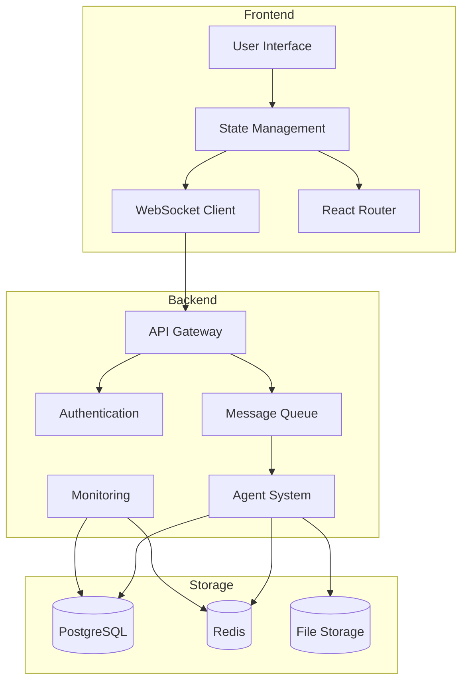
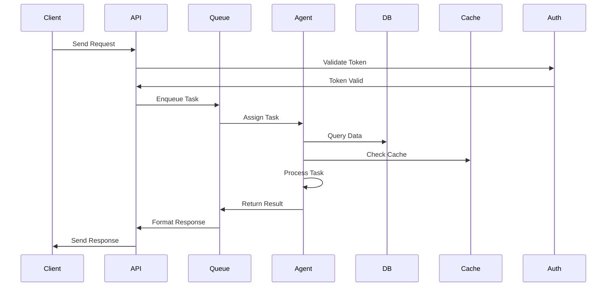

# The New Fuse Architecture

## Overview

The New Fuse is a powerful workflow automation platform built on a modular, component-based architecture that enables users to create, customize, and execute workflows by connecting various nodes in a drag-and-drop interface. The system integrates multiple AI coding assistants with the Model Context Protocol (MCP) and provides a modern TypeScript-based AI communication system designed for seamless interaction between different AI agents through API integration.

## High-Level Architecture

The New Fuse is built as a modern, scalable application using a microservices-inspired architecture with monorepo organization.



## Tech Stack

- **Frontend**: React 18, Vite, Tailwind CSS, ReactFlow, Redux Toolkit
- **Backend**: NestJS
- **Communication**: Redis pub/sub, WebSocket
- **Database**: PostgreSQL, MongoDB
- **Caching**: Redis
- **Type Safety**: TypeScript throughout

## Core Components

### 1. Core Engine

The workflow engine (`workflow-engine.ts`) is responsible for executing workflows by:
- Loading workflow definitions from the database
- Building an execution queue based on node dependencies
- Executing nodes in the correct order
- Handling errors and tracking execution metrics

Key features:
- Supports parallel execution of independent nodes
- Provides timeout and abort capabilities
- Tracks execution metrics and logs

### 2. Agent System

```typescript
interface Agent {
  id: string;
  type: AgentType;
  capabilities: string[];
  channel: string;
  state: AgentState;
}
```

The Agent System manages:
- API-based AI integration
- Task coordination and management
- State tracking and persistence
- Memory management and cleanup

### 3. Node Types

The platform supports various node types that can be connected to form workflows:

#### API Node
Makes HTTP requests to external APIs with features like:
- Support for various HTTP methods (GET, POST, PUT, DELETE, PATCH)
- Authentication (Basic, Bearer, API Key)
- Response mapping
- Error handling with retry logic and fallback values
- Usage tracking

#### Vector Store Node
Interacts with vector databases for semantic search and similarity calculations:
- Supports operations: store, retrieve, update, delete, similarity, cluster
- Configurable embedding models
- Metadata filtering
- Similarity metrics (cosine, euclidean, dot product)

#### Document Processing Node
Processes documents with operations like:
- Parsing documents to extract text
- Extracting structured data using rules
- Summarizing documents
- Converting between formats
- OCR processing
- Translation
- Splitting documents into chunks

#### Webhook Node
Enables integrations with external systems:
- Trigger webhooks to send data
- Receive webhook data
- Listen for webhook events
- Support for various webhook services (Zapier, Integromat, n8n)

### 4. Node Factory

The Node Factory (`node-factory.ts`) creates node instances based on their type and configuration:
- Maintains a registry of available node types
- Provides a unified interface for creating nodes
- Allows for runtime registration of new node types

### 5. Communication System

```typescript
interface CommunicationBridge {
  initialize(): Promise<void>;
  subscribe(channels: string[]): Promise<void>;
  publish(channel: string, message: AgentMessage): Promise<void>;
}
```

The Communication System includes:
- Redis-based pub/sub channels
- WebSocket server for real-time updates
- External AI service integration
- Robust error handling and recovery

### 6. Database Layer

The Database class (`database.ts`) provides an abstraction over MongoDB:
- Connection management
- Collection access
- Index creation
- Query execution

The system also uses PostgreSQL for persistent storage with:
- TypeORM for database access
- Connection pooling
- Data replication support

### 7. MCP Integration

- **MCPManager**: Central coordinator for MCP functionality
- **ToolRegistry**: Manages and executes MCP tools
- **MCPClient**: Handles communication with MCP servers

### 8. AI Integration

- OpenAI API integration
- Standardized API interfaces
- Response handling and validation
- Error recovery mechanisms

## System Features

### 1. Message Handling

- Structured message format with version control
- Priority levels and queuing
- Error recovery and retry mechanisms
- Message validation and acknowledgment
- Neural interfaces for agent-to-agent learning

### 2. Task Management

- Task proposal and execution
- Dependency tracking
- Progress monitoring
- State persistence
- Collective intelligence protocols

### 3. API Usage Tracking

The API Usage Tracker (`api-usage-tracker.ts`) monitors and logs API usage:
- Tracks usage by user, endpoint, and time
- Supports billing calculations
- Enforces rate limits based on user plans
- Provides usage analytics by node, workflow, and service provider

## Communication Flow



## UI Components

### 1. Node Toolbar

The Node Toolbar (`NodeToolbar.tsx`) provides the UI for adding nodes to workflows:
- Organized by category (Data Sources, Processing, Integrations, Utilities)
- Searchable node list
- Configuration dialogs for each node type
- Basic and advanced configuration modes

### 2. Workflow Toolbar

The Workflow Toolbar (`WorkflowToolbar.tsx`) provides UI for workflow management:
- Save, run, and schedule workflows
- View execution history and analytics
- Share workflows with other users
- Clone and export workflows
- Publish workflows

## Workflow Execution

When a workflow is executed, the following steps occur:

1. The workflow definition is loaded from the database
2. An execution record is created to track progress
3. The workflow engine builds an execution queue based on node dependencies
4. Nodes are executed in dependency order, with independent nodes running in parallel
5. Output from one node is passed as input to dependent nodes
6. Execution metrics are tracked for performance analysis
7. Results are stored and returned to the user

## Security Architecture

### Authentication Flow
- JWT-based authentication using Passport.js
  - Tokens include:
    - Access Token (short-lived)
    - Refresh Token (long-lived, secure HTTP-only cookie)
  - Password requirements:
    - Minimum 8 characters
    - At least one uppercase letter
    - At least one lowercase letter
    - At least one number
    - At least one special character
- Role-Based Access Control (RBAC) implemented using CASL
  - Defined roles:
    - Admin: Full system access
    - User: Limited to own resources
    - Agent: Limited to assigned tasks
  - Permission granularity at the resource level
  - Role inheritance hierarchy

### Security Measures
- TLS/SSL encryption for all API endpoints
- WebSocket connections secured with WSS
- HTTPS enforced across all environments
- CORS configured with specific allowed origins
- Passwords hashed using bcrypt (cost factor 12)
- Sensitive data encrypted using AES-256-GCM
- Database connection secured with SSL
- Regular backup encryption
- Zod schema validation for all inputs
- SQL injection prevention via TypeORM
- XSS prevention through React's built-in escaping
- Content Security Policy (CSP) headers

### Rate Limiting
- Per-user and per-IP rate limiting
- Graduated rate limits based on user tier
- Automatic blocking of suspicious activity
- AI Operation Limits:
  - Neural memory operations: 100/minute
  - Vector similarity searches: 50/minute
  - Pattern recognition: 30/minute
  - Concurrent agent tasks: 5/user
  - Memory storage: 1GB/user
- Monitoring and alerting for limit breaches

### Integration Security
- API key required for external integrations
- Request signing for webhook endpoints
- Request timestamp validation
- Payload size limits

### Monitoring and Logging
- Comprehensive monitoring
- Error tracking
- Security Logging
  - Authentication attempts (success/failure)
  - Authorization violations
  - Resource access patterns
  - System configuration changes
- Alerts for security events

## Error Handling

The system implements robust error handling:
- Node-level error handling with retry logic
- Fallback values for nodes that fail
- Workflow-level error reporting
- Debugging mode with detailed logs
- Timeout protection to prevent runaway executions

## Integration Points

### 1. External Services
- Zapier integration for connecting to thousands of apps
- Vector database connectors (Pinecone, Weaviate, Milvus)
- Document processing services (OCR, translation, summarization)
- AI services (OpenAI, Anthropic, Hugging Face)

### 2. API Gateway
- RESTful API for programmatic access
- WebSocket API for real-time updates
- GraphQL API for flexible data querying
- Webhook endpoints for event-driven integrations

## Development Guidelines

### 1. TypeScript Best Practices
- Use strict type checking
- Implement interfaces for data structures
- Use enums for constants
- Leverage generics where appropriate
- Document with TSDoc comments

### 2. React Component Structure
```typescript
interface ComponentProps {
  // Props definition
}

export const Component: React.FC<ComponentProps> = ({ }) => {
  // Implementation
  return (
    <div>
      {/* JSX */}
    </div>
  );
};
```

### 3. NestJS Module Structure
```typescript
@Module({
  imports: [],
  controllers: [],
  providers: [],
  exports: []
})
export class FeatureModule {}
```

## Future Development

1. Enhanced Neural Integration
2. Advanced Memory Systems
3. Collective Intelligence Enhancement
4. Autonomous Evolution
5. Quantum-Ready Infrastructure

## References

- [API Documentation](../reference/API.md)
- [Component Documentation](../reference/COMPONENTS.md)
- [Security Documentation](../development/SECURITY.md)
- [Developer Workflow](../development/DEVELOPER_WORKFLOW.md)