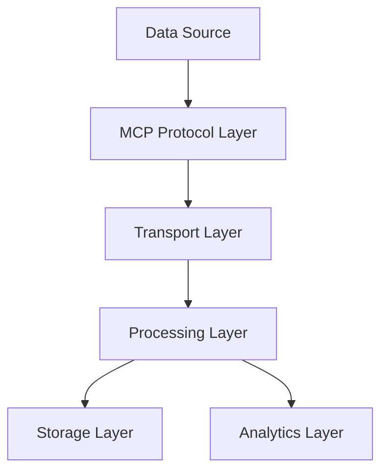
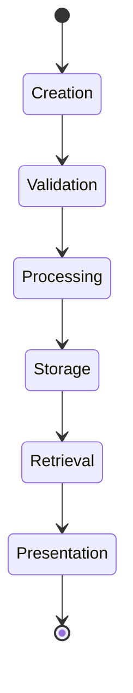

# Master Information Architecture

## Overview

This document serves as the authoritative source for The New Fuse's information architecture and data exchange patterns across all environments. It defines the core structures, patterns, and protocols for information flow throughout the system.

## Core Information Structure

### 1. Data Exchange Protocol

The Model Context Protocol (MCP) serves as the primary data exchange mechanism:



#### Protocol Layers
1. **Data Source Layer**
   - Document Sources
   - Agent Communications
   - User Interactions
   - External Integrations

2. **MCP Protocol Layer**
   - Message Format Standards
   - Validation Rules
   - Schema Definitions
   - Version Control

3. **Transport Layer**
   - WebSocket Connections
   - HTTP/REST APIs
   - Redis Channels
   - Event Streams

4. **Processing Layer**
   - Document Processing
   - Agent Task Management
   - Workflow Execution
   - Data Transformation
   - A2A Communication (Primarily via ACAProtocolAdapter, maintaining backward compatibility)
   - Workflow Builder

5. **Storage Layer**
   - Document Store
   - State Management
   - Cache Systems
   - Audit Logs

6. **Analytics Layer**
   - Performance Metrics
   - Usage Analytics
   - Error Tracking
   - Behavioral Analysis

### 2. Information Categories

#### Core System Information
- System Architecture
- Component Specifications
- Security Protocols
- Integration Patterns

#### Runtime Information
- Agent States
- Workflow Status
- System Metrics
- Error States

#### User Information
- Authentication Data
- Preferences
- Activity Logs
- Access Rights

#### Processing Information
- Task Queues
- Processing Status
- Resource Allocation
- Output Results

### 3. Data Flow Patterns

#### Internal Communication
1. **Component-to-Component**
   - Direct Function Calls
   - Event Emission
   - State Updates
   - Shared Memory

2. **Service-to-Service**
   - Message Queues
   - API Calls
   - Event Streams
   - Pub/Sub Channels

#### External Communication
1. **Client-to-Server**
   - REST APIs
   - WebSocket
   - GraphQL
   - Server-Sent Events

2. **Server-to-External**
   - Webhooks
   - API Integration
   - Data Exports
   - Stream Processing
   - Python Bridge for ADK Integration (Facilitates communication with Google's ADK via `EnhancedPythonBridge`)

### 4. Information Lifecycle



#### Stages
1. **Creation**
   - User Input
   - System Generation
   - External Import
   - Agent Production

2. **Validation**
   - Schema Validation
   - Business Rules
   - Security Checks
   - Format Verification

3. **Processing**
   - Transformation
   - Enrichment
   - Analysis
   - Classification

4. **Storage**
   - Persistence
   - Indexing
   - Versioning
   - Archival

5. **Retrieval**
   - Query Processing
   - Access Control
   - Cache Management
   - Data Assembly

6. **Presentation**
   - Formatting
   - Rendering
   - Translation
   - Distribution

## Implementation Guidelines

### 1. Data Structure Standards

#### Document Format
```typescript
interface Document {
  id: string;
  type: DocumentType;
  content: any;
  metadata: {
    version: string;
    created: Date;
    modified: Date;
    owner: string;
    tags: string[];
  };
  security: {
    accessLevel: AccessLevel;
    encryption: EncryptionType;
    signature: string;
  };
}
```

#### Message Format
```typescript
interface Message {
  id: string;
  type: MessageType;
  payload: any;
  metadata: {
    timestamp: Date;
    sender: string;
    receiver: string;
    priority: Priority;
  };
  tracing: {
    correlationId: string;
    spanId: string;
    parentId: string;
  };
}
```

### 2. Integration Patterns

#### Internal Integration
- Use Event-Driven Architecture
- Implement Circuit Breakers
- Apply Retry Patterns
- Maintain Idempotency

#### External Integration
- API Versioning
- Rate Limiting
- Authentication/Authorization
- Error Handling

### 3. Security Standards

#### Data Protection
- End-to-End Encryption
- Data Masking
- Access Controls
- Audit Logging

#### Communication Security
- TLS/SSL
- API Keys
- JWT Tokens
- Request Signing

### 4. UI Component Standards (New Section)
- **Consolidation:** Strive for a single, reusable implementation for common UI components to ensure consistency and maintainability. Example: The `AgentCard` component was consolidated from multiple versions into `packages/ui-components/src/core/agent/AgentCard.tsx`.
- **Modularity:** Design components to be modular and easily configurable through props.
- **Accessibility:** Ensure components adhere to accessibility best practices (WCAG).
- **Theming:** Components should support the application's theming system.

## Cross-Environment Standards

### 1. Development Environment
- Local Development
- Testing Environment
- Staging Environment
- Production Environment

### 2. Data Synchronization
- Real-time Sync
- Batch Processing
- Delta Updates
- Conflict Resolution

### 3. Version Control
- Schema Versioning
- API Versioning
- Document Versioning
- Code Versioning

## Monitoring and Maintenance

### 1. Health Checks
- System Status
- Performance Metrics
- Error Rates
- Resource Usage

### 2. Alerts and Notifications
- Critical Errors
- Performance Issues
- Security Events
- System Changes

## References

This document supersedes and consolidates information from:
- DOCUMENT-INVENTORY-MASTER.md
- DOCUMENT-INVENTORY-COMPREHENSIVE.md
- DOCUMENT-INVENTORY-UPDATED.md
- API_SPECIFICATION.md
- ARCHITECTURE.md

For specific implementation details, refer to:
- docs/MCP-GUIDE.md for MCP implementation
- docs/architecture/ARCHITECTURE.md for system architecture
- docs/security/SECURITY.md for security implementation
- docs/api/API_GUIDE.md for API documentation