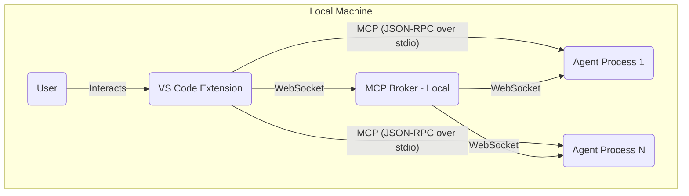

# The New Fuse Network Map

## Overview

This document provides a high-level visualization and description of the network topology for The New Fuse deployments. It aims to show how different components (VS Code Extensions, MCP Brokers, Agents, Databases, etc.) are connected across various environments (e.g., local development, staging, production).

**Purpose:**
- Understand data flow between major components.
- Visualize deployment strategies across different environments.
- Identify potential network bottlenecks or points of failure.
- Assist in planning network security and configuration.

**Maintenance:**
This map should be updated whenever significant changes are made to:
- Deployment architecture (e.g., adding new services, changing hosting).
- Core communication protocols or pathways (e.g., switching from WebSocket to gRPC).
- Introduction or removal of major infrastructure components.
- Changes in how agents connect to the MCP Broker or other services.

*(Update this document according to the guidelines in `docs/AI_DOCUMENTATION_GUIDE.md`)*

---

## Environments

*(Use subsections for different environments like Local Development, Staging, Production, etc.)*

### Local Development Environment

**Description:** Typical setup for a single developer running the system locally.

**Components:**
- **User:** Interacts with VS Code.
- **VS Code Extension:** Hosts the UI, manages local agent processes, potentially connects to a local broker.
- **Agent Process:** Local processes providing capabilities via MCP (e.g., filesystem access).
- **MCP Broker (Local):** Optional local broker instance for testing distributed scenarios.

*(Add more details as needed)*

### Staging Environment

**Description:** Pre-production environment mirroring production setup.

*(Add Mermaid diagram and component descriptions for Staging)*

### Production Environment

**Description:** Live environment serving end-users.

*(Add Mermaid diagram and component descriptions for Production)*

---

## Key Communication Paths

- **VS Code <-> Agent Process (Local):** JSON-RPC over stdio via `MCPClient`.
- **VS Code <-> MCP Broker:** Secure WebSocket (WSS).
- **Agent <-> MCP Broker:** Secure WebSocket (WSS).
- *(Add other significant paths)*
