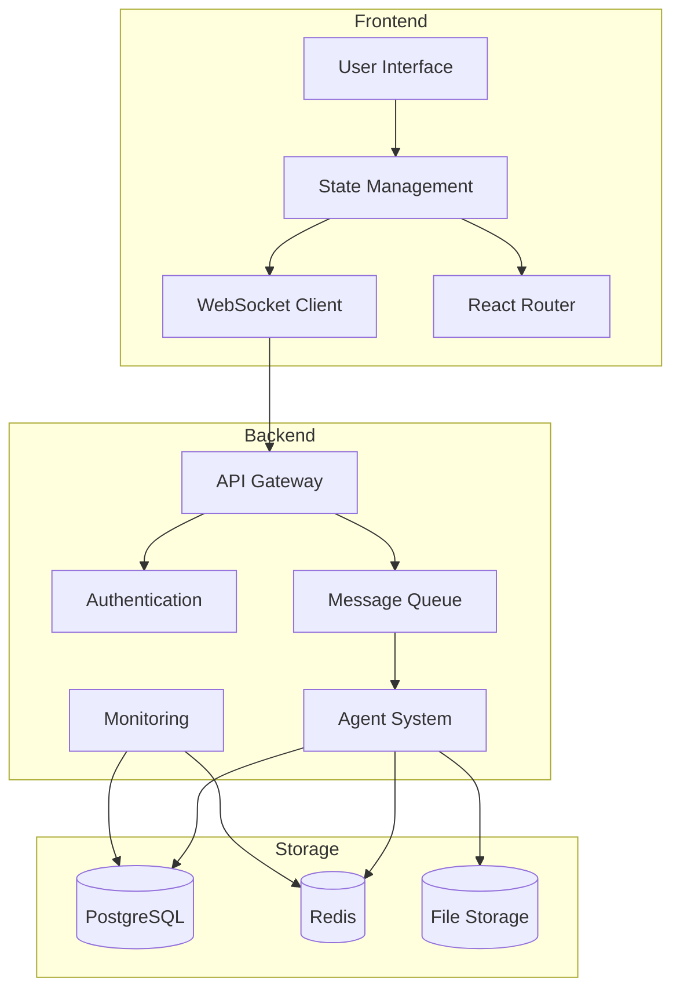
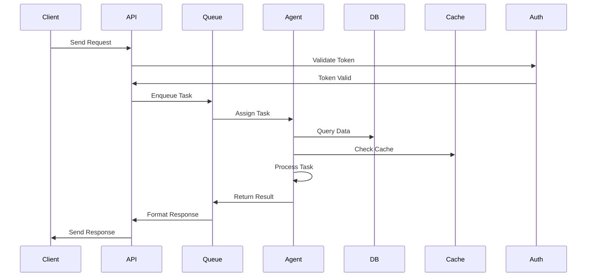
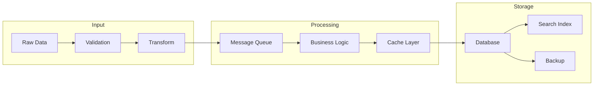
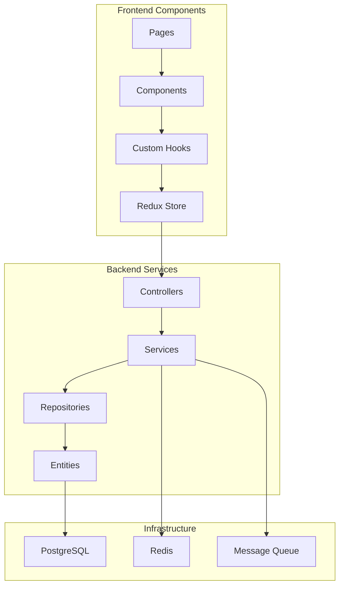
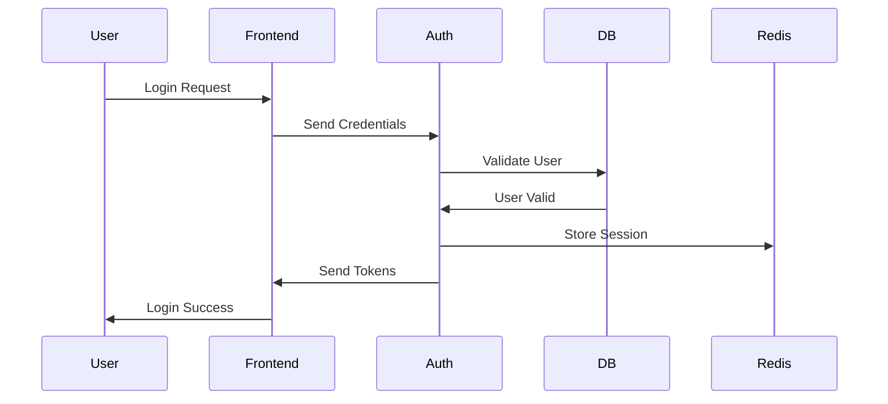
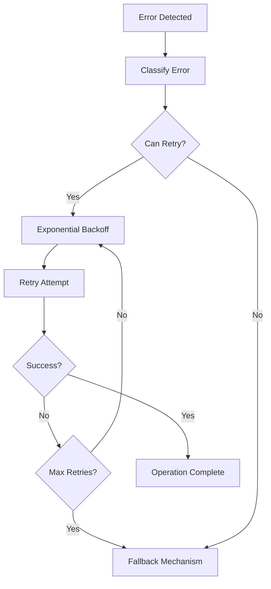
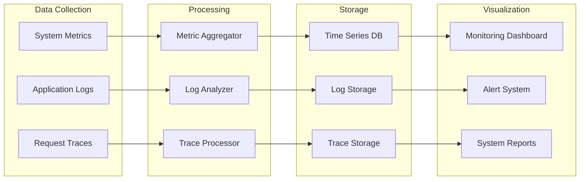
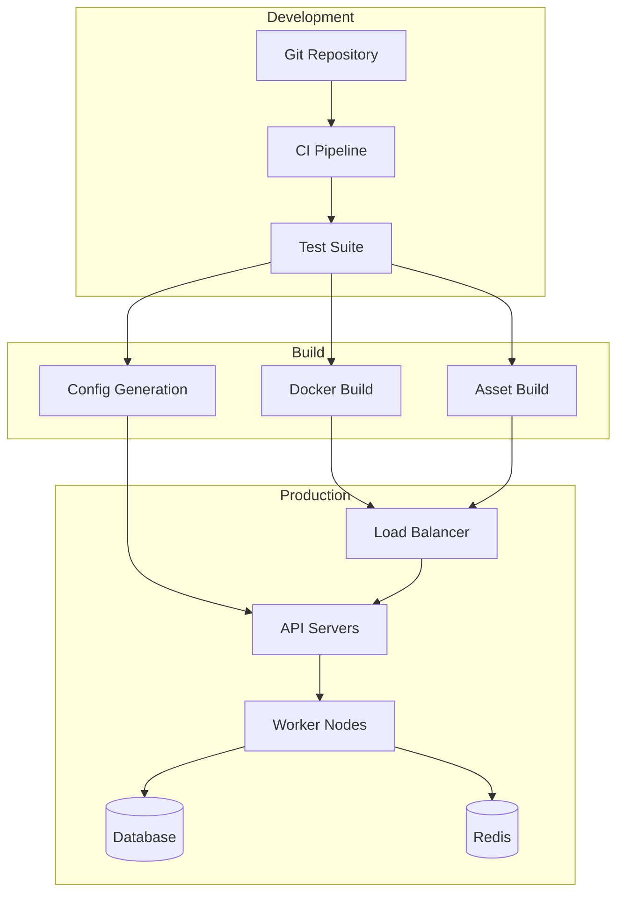
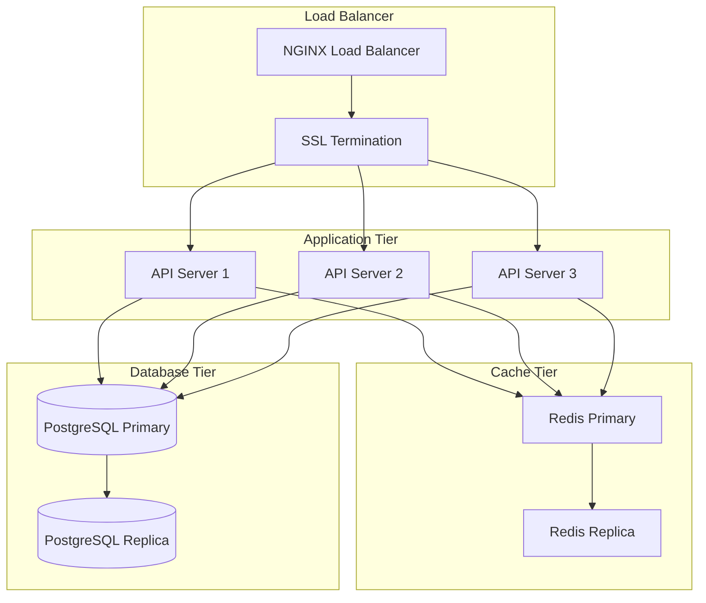

# System Architecture Diagrams

## High-Level System Architecture

## Message Flow Architecture

## Data Flow Architecture

## Component Interaction

## Authentication Flow

## Error Recovery Flow

## Monitoring System

## Deployment Architecture

## Scaling Architecture

