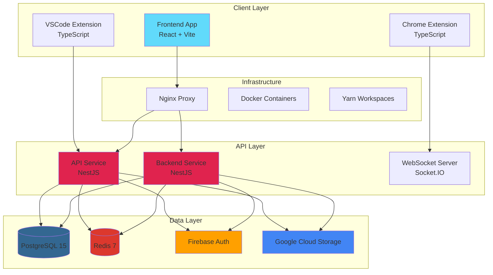

# The New Fuse - Technology Stack Documentation

> **Last Updated: January 2025**

## Overview

The New Fuse is a comprehensive full-stack application built with modern technologies, featuring a monorepo architecture with multiple applications and packages. This document provides a detailed breakdown of our technology stack across all layers of the application.

## 🏗️ Architecture & Infrastructure

### **Monorepo Management**

- **Package Manager**: [`Yarn 4.9.1`](package.json:6) with Berry (modern Yarn with PnP support)
- **Workspace Structure**: Multi-package monorepo with apps and packages
- **Build System**: Yarn workspaces with parallel execution support

### **Containerization & Deployment**

- **Container Runtime**: Docker with multi-stage builds
- **Orchestration**: [`Docker Compose`](docker-compose.production.yml:1) for service coordination
- **Web Server**: [`Nginx`](docker-compose.production.yml:114) as reverse proxy and load balancer
- **Environment Management**: Environment-specific configurations

### **Development Environment**

- **OS Support**: Cross-platform (macOS, Linux, Windows)
- **Shell**: Zsh with custom scripts
- **IDE Integration**: VSCode extension for enhanced development experience

## 🎯 Frontend Technologies

### **Frontend Core Framework**

- **Primary**: [`React 18.3.0`](apps/frontend/package.json:74) with functional components and hooks
- **Language**: [`TypeScript 5.3.3`](package.json:98) for type safety
- **Build Tool**: [`Vite 6.2.1`](apps/frontend/package.json:137) for fast development and optimized builds

### **UI Component Libraries**

- **Primary System**: [`Chakra UI 2.8.2`](apps/frontend/package.json:21) - Modern component library
- **Headless Components**: [`Radix UI`](apps/frontend/package.json:38-51) primitives for accessibility
- **Material Design**: [`Material-UI 6.4.0`](apps/frontend/package.json:36) for Material Design components
- **Icons**: [`Heroicons`](apps/frontend/package.json:32), [`Phosphor Icons`](apps/frontend/package.json:37), [`Lucide React`](apps/frontend/package.json:71)

### **Styling & Animations**

- **CSS Framework**: [`Tailwind CSS 3.4.1`](apps/frontend/package.json:133) for utility-first styling
- **CSS-in-JS**: [`Emotion`](apps/frontend/package.json:24-25) for styled components
- **Animations**: [`Framer Motion 11.18.1`](apps/frontend/package.json:69) for smooth animations
- **Theme System**: [`next-themes 0.4.4`](apps/frontend/package.json:73) for dark/light mode

### **State Management**

- **Global State**: [`Redux Toolkit 2.2.6`](apps/frontend/package.json:52) with modern Redux patterns
- **Local State**: [`Zustand 4.5.0`](apps/frontend/package.json:95) for lightweight state management
- **Server State**: [`TanStack Query 5.67.2`](apps/frontend/package.json:53) for API state management
- **Form State**: [`React Hook Form 7.49.3`](apps/frontend/package.json:78) with validation

### **Routing & Navigation**

- **Router**: [`React Router DOM 7.3.0`](apps/frontend/package.json:83) for client-side routing
- **Navigation**: Type-safe routing with parameter validation

### **Code Editor Integration**

- **Editor**: [`Monaco Editor 0.39.0`](apps/frontend/package.json:72) - VS Code editor in browser
- **React Integration**: [`@monaco-editor/react 4.6.0`](apps/frontend/package.json:34)

## 🔧 Backend Technologies

### **Backend Core Framework**

- **Primary**: [`NestJS 11.0.0`](apps/backend/package.json:27-37) - Enterprise Node.js framework
- **Runtime**: Node.js with ES modules support
- **Language**: [`TypeScript 5.0.0`](apps/backend/package.json:106) throughout

### **Database & ORM**

- **Primary Database**: [`PostgreSQL 15`](docker-compose.production.yml:95) (Alpine)
- **ORM Options**:
  - [`Prisma 6.5.0`](apps/backend/package.json:38) - Modern database toolkit
  - [`TypeORM 0.3.21`](apps/backend/package.json:72) - Alternative ORM with decorators
- **Caching**: [`Redis 7`](docker-compose.production.yml:79) (Alpine) for session storage and caching

### **Authentication & Security**

- **JWT**: [`jsonwebtoken 9.0.2`](apps/backend/package.json:60) for token-based auth
- **Passport**: [`Passport.js 0.7.0`](apps/backend/package.json:61) with strategies:
  - [`passport-jwt 4.0.1`](apps/backend/package.json:63) for JWT validation
  - [`passport-google-oauth20 2.0.0`](apps/backend/package.json:62) for Google OAuth
- **Password Hashing**: [`bcrypt 5.1.0`](apps/backend/package.json:45) and [`bcryptjs 2.4.3`](apps/backend/package.json:46)
- **Security Middleware**: [`Helmet.js 8.0.0`](apps/backend/package.json:57) for HTTP headers
- **CORS**: [`cors 2.8.5`](apps/backend/package.json:51) for cross-origin requests

### **Real-time Communication**

- **WebSockets**: [`Socket.IO 4.7.2`](apps/backend/package.json:71) for real-time features
- **NestJS Integration**: [`@nestjs/websockets`](apps/backend/package.json:37) and [`@nestjs/platform-socket.io`](apps/backend/package.json:34)

### **API Documentation & Validation**

- **OpenAPI**: [`@nestjs/swagger 7.1.17`](apps/backend/package.json:35) for API documentation
- **Validation**: [`class-validator 0.14.0`](apps/backend/package.json:48) and [`class-transformer 0.5.1`](apps/backend/package.json:47)
- **Schema Validation**: [`Zod 3.22.4`](apps/backend/package.json:73) for runtime type checking

## 📱 Browser Extensions

### **Chrome Extension**

- **Language**: TypeScript with modern ES modules
- **Build Tool**: [`Webpack 5.89.0`](package.json:107) with custom configuration
- **Manifest**: Manifest V3 for modern Chrome extension APIs
- **Communication**: WebSocket-based communication with main application

### **VSCode Extension**

- **Language**: TypeScript with VSCode Extension APIs
- **Integration**: [`@types/vscode 1.100.0`](package.json:66) for type definitions
- **Features**: Code editing, debugging, and project management integration

### **Inter-Extension Communication**

- **Protocol**: Custom WebSocket protocol for real-time communication
- **State Sync**: Shared state management across extensions

## 🔧 Development Tools & Quality

### **Language & Runtime**

- **Primary Language**: [`TypeScript 5.3.3`](package.json:98) across all packages
- **Node.js**: Latest LTS with ES module support
- **Module System**: ES modules with proper import/export patterns

### **Testing Framework**

- **Unit Testing**: [`Jest 29.7.0`](package.json:82) with [`ts-jest 29.1.0`](package.json:95)
- **React Testing**: [`React Testing Library 16.0.0`](apps/frontend/package.json:107) for component testing
- **E2E Testing**: [`Selenium WebDriver 4.0.0`](apps/frontend/package.json:132) for browser automation
- **Fast Testing**: [`Vitest`](apps/frontend/package.json:140) for Vite-based projects
- **Test Environment**: [`jsdom 26.0.0`](apps/frontend/package.json:130) for DOM simulation

### **Code Quality & Linting**

- **ESLint**: [`eslint 8.56.0`](package.json:72) with TypeScript support
- **TypeScript ESLint**: [`@typescript-eslint/*`](package.json:67-68) for TypeScript-specific rules
- **Prettier**: [`prettier 3.0.0`](package.json:87) for consistent code formatting
- **React Rules**: [`eslint-plugin-react-hooks`](package.json:79) for React best practices

### **Git Hooks & Automation**

- **Pre-commit**: [`Husky 9.0.0`](package.json:81) for Git hooks
- **Staged Files**: [`lint-staged 15.2.0`](package.json:84) for pre-commit linting
- **Commit Standards**: [`@commitlint/*`](package.json:45-46) for conventional commits

### **Documentation & Component Development**

- **Component Stories**: [`Storybook 8.0.0`](package.json:57-58) for component documentation
- **Interactive Development**: Storybook with essential addons

### **Build Tools & Bundlers**

- **Frontend**: [`Vite 6.2.1`](apps/frontend/package.json:137) with plugins
- **Extensions**: [`Webpack 5.89.0`](package.json:107) for Chrome/VSCode extensions
- **Transpilation**: [`Babel 7.24.0`](package.json:40-43) with TypeScript preset
- **Module Resolution**: [`tsconfig-paths 4.2.0`](package.json:96) for path mapping

## ☁️ External Integrations & Services

### **Firebase Services**

- **Authentication**: [`@firebase/auth 1.5.1`](apps/frontend/package.json:28) for user management
- **Database**: [`@firebase/firestore 4.4.0`](package.json:107) for real-time data
- **Admin SDK**: [`firebase-admin 11.11.1`](apps/backend/package.json:56) for server-side operations
- **App Core**: [`@firebase/app 0.9.25`](apps/frontend/package.json:26) for Firebase initialization

### **Google Cloud Platform**

- **Storage**: [`@google-cloud/storage 7.15.0`](apps/backend/package.json:25) for file management
- **Authentication**: Google OAuth 2.0 integration

### **HTTP & API Communication**

- **HTTP Client**: [`Axios 1.6.5`](apps/frontend/package.json:60) for API requests
- **WebSockets**: [`ws 8.18.0`](apps/frontend/package.json:93) for real-time communication

### **Internationalization**

- **i18n Framework**: [`i18next 23.7.11`](apps/frontend/package.json:70) for translations
- **React Integration**: [`react-i18next 14.0.0`](apps/frontend/package.json:80)

## 🔄 DevOps & Infrastructure

### **Process Management**

- **Development**: [`Nodemon 3.0.0`](package.json:85) for auto-restart during development
- **Production**: PM2 or Docker for process management
- **Monitoring**: Built-in health checks and metrics collection

### **Environment Configuration**

- **Environment Variables**: [`dotenv 16.3.1`](apps/backend/package.json:53) for configuration
- **Cross-Platform**: [`cross-env 7.0.3`](package.json:71) for environment variable management
- **Configuration Validation**: Zod schemas for environment validation

### **Session & Cache Management**

- **Session Store**: [`connect-redis 7.1.0`](apps/backend/package.json:50) for Redis-backed sessions
- **Caching**: [`ioredis 5.3.2`](apps/backend/package.json:59) for Redis client
- **Session Middleware**: [`express-session 1.17.3`](apps/backend/package.json:55)

### **Performance & Optimization**

- **Compression**: [`compression 1.8.0`](apps/backend/package.json:49) for HTTP compression
- **Asset Optimization**: Vite's built-in optimizations
- **Code Splitting**: Automatic code splitting with React.lazy

### **Version Management**

- **Changesets**: [`@changesets/cli 2.27.1`](package.json:44) for version management
- **Semantic Versioning**: Automated version bumping and changelog generation

## 📊 Data Visualization & UI Enhancement

### **Charts & Graphs**

- **D3.js**: [`d3 7.9.0`](apps/frontend/package.json:64) for custom visualizations
- **React Charts**: [`Recharts 2.15.0`](apps/frontend/package.json:87) for React-based charts
- **Network Graphs**: [`d3-force-graph 0.4.3`](apps/frontend/package.json:65) for node-link diagrams
- **Flow Diagrams**: [`ReactFlow 11.10.1`](apps/frontend/package.json:86) for interactive diagrams

### **User Interface Enhancement**

- **File Operations**: [`file-saver 2.0.5`](apps/frontend/package.json:67) for client-side file downloads
- **Date Handling**: [`date-fns 3.0.6`](apps/frontend/package.json:66) for date manipulation
- **Device Detection**: [`react-device-detect 2.2.3`](apps/frontend/package.json:75) for responsive behavior
- **Loading States**: [`react-loading-skeleton 3.3.1`](apps/frontend/package.json:81) for skeleton screens

### **Notifications & Feedback**

- **Toast Notifications**:
  - [`react-hot-toast 2.4.1`](apps/frontend/package.json:79)
  - [`react-toastify 11.0.2`](apps/frontend/package.json:84)
- **Tooltips**: [`react-tooltip 5.28.0`](apps/frontend/package.json:85)
- **Error Boundaries**: [`react-error-boundary 5.0.0`](apps/frontend/package.json:77)

## 🔧 Utility Libraries & Helpers

### **Reactive Programming**

- **RxJS**: [`rxjs 7.8.1`](package.json:90) for reactive programming patterns
- **Observables**: Stream-based data flow management

### **Text & Data Processing**

- **Case Conversion**: [`change-case 4.1.2`](apps/frontend/package.json:61) and [`text-case 1.0.9`](apps/frontend/package.json:91)
- **Title Case**: [`titlecase 1.1.1`](apps/frontend/package.json:92)
- **Class Names**: [`clsx 2.1.1`](apps/frontend/package.json:63) and [`tailwind-merge 2.6.0`](apps/frontend/package.json:90)
- **CSS Variants**: [`class-variance-authority 0.7.1`](apps/frontend/package.json:62)

### **Security & Sanitization**

- **HTML Sanitization**: [`sanitize-html 2.11.0`](apps/backend/package.json:70) for XSS prevention
- **Input Validation**: Comprehensive validation layers

## 🎯 Workspace Packages

The project includes several internal workspace packages:

- **`@the-new-fuse/core`**: Core utilities and shared logic
- **`@the-new-fuse/types`**: Shared TypeScript type definitions  
- **`@the-new-fuse/ui-components`**: Reusable UI component library
- **`@the-new-fuse/feature-suggestions`**: Feature suggestion functionality
- **`@the-new-fuse/database`**: Database utilities and migrations
- **`@the-new-fuse/utils`**: Common utility functions

## 📋 Architecture Diagram



## 🚀 Development Workflow

### **Getting Started**

```bash
# Install dependencies
yarn install

# Start development servers
yarn dev

# Run tests
yarn test

# Build for production
yarn build:production
```

### **Key Commands**

- **Development**: `yarn dev` - Start all services in development mode
- **Testing**: `yarn test` - Run all tests across workspaces  
- **Linting**: `yarn lint` - Run ESLint across all packages
- **Building**: `yarn build` - Build all packages for production
- **Cleaning**: `yarn clean:all` - Clean all build artifacts and dependencies

## 📚 Additional Resources

- [Implementation Plan](docs/IMPLEMENTATION-PLAN.md)
- [Architecture Documentation](docs/architecture/ARCHITECTURE.md)
- [Component Standards](docs/reference/component-standards.md)
- [MCP Integration Guide](docs/mcp-integration-guide.md)
- [Build Process](docs/development/build-process.md)

## 🔍 Tech Stack Analysis & Recommendations

### **✅ Strengths & Compatible Combinations**

**1. Vite + TypeScript + React**

- **Perfect Match**: Vite has excellent TypeScript support out-of-the-box
- **Fast Development**: HMR works seamlessly with TypeScript
- **Build Optimization**: Vite's esbuild-based TypeScript compilation is extremely fast

**2. NestJS + TypeScript + PostgreSQL**

- **Enterprise-Grade**: NestJS is built for TypeScript from the ground up
- **Decorator Support**: Perfect synergy with TypeORM and class-validator
- **Scalable Architecture**: Modular structure aligns well with monorepo approach

**3. Monorepo + Yarn Workspaces**

- **Modern Setup**: Yarn 4.9.1 with PnP is cutting-edge
- **Dependency Management**: Workspace linking works excellently
- **Build Coordination**: Parallel builds across packages

### **⚠️ Potential Issues & Concerns**

**1. UI Library Overlap**

```typescript
// CONCERN: Multiple UI systems may cause conflicts
- Chakra UI 2.8.2 (primary)
- Material-UI 6.4.0 (secondary)
- Radix UI (headless)
- Tailwind CSS (utility classes)
```

**Risk**: Style conflicts, bundle size bloat, inconsistent design language
**Recommendation**: Choose ONE primary system (Chakra UI) and phase out Material-UI

**2. ORM Duplication**

```typescript
// CONCERN: Two ORMs in same project
- Prisma 6.5.0 (modern)
- TypeORM 0.3.21 (decorator-based)
```

**Risk**: Code confusion, maintenance overhead, learning curve
**Recommendation**: Standardize on Prisma for new development

**3. Testing Framework Redundancy**

```typescript
// CONCERN: Multiple testing approaches
- Jest 29.7.0 (traditional)
- Vitest (Vite-native)
```

**Risk**: Configuration conflicts, different behavior
**Recommendation**: Migrate to Vitest for Vite projects, keep Jest for Node.js services

**4. State Management Complexity**

```typescript
// CONCERN: Multiple state solutions
- Redux Toolkit (global)
- Zustand (local)
- TanStack Query (server)
```

**Assessment**: Actually good separation of concerns, but requires clear guidelines

### **🚨 Critical Compatibility Issues**

**1. React Router DOM 7.3.0**

```typescript
// POTENTIAL ISSUE: Version conflicts
React Router v7 is relatively new and may have:
- Breaking changes from v6
- Plugin compatibility issues
- Documentation gaps
```

**Action Required**: Verify all routing patterns work as expected

**2. Yarn 4.9.1 + Node Modules**

```typescript
// POTENTIAL ISSUE: PnP vs node_modules
Some packages may not work with Yarn PnP:
- Chrome extension builds
- Some legacy dependencies
```

**Mitigation**: Configure `.yarnrc.yml` with fallbacks if needed

**3. TypeScript Version Mismatch**

```typescript
// INCONSISTENCY DETECTED:
- Frontend: TypeScript 5.3.3
- Backend: TypeScript 5.0.0
```

**Fix Required**: Standardize on TypeScript 5.3.3 across all packages

### **📊 Performance Considerations**

**1. Bundle Size Concerns**

```typescript
// HEAVY DEPENDENCIES:
- D3.js (large visualization library)
- Monaco Editor (VS Code editor)
- Multiple UI libraries
- Chart libraries (Recharts + D3)
```

**Optimization**: Implement code splitting and lazy loading

**2. Build Process Efficiency**

```typescript
// POTENTIAL BOTTLENECKS:
- Webpack for extensions (slower)
- Multiple TypeScript compilations
- Docker multi-stage builds
```

**Improvement**: Consider esbuild for extensions

### **🔧 Recommended Improvements**

**1. Standardization**

```bash
# Update package.json files to use consistent versions
yarn workspace @the-new-fuse/backend add typescript@5.3.3
```

**2. UI Library Consolidation**

```typescript
// Phase out Material-UI, standardize on:
- Chakra UI (primary components)
- Radix UI (headless primitives)
- Tailwind CSS (utilities only)
```

**3. ORM Decision**

```typescript
// Choose one ORM strategy:
Option A: Prisma everywhere (recommended)
Option B: TypeORM for complex queries, Prisma for simple ones
```

**4. Testing Strategy Clarification**

```typescript
// Recommended testing approach:
- Vitest: Frontend packages (Vite-based)
- Jest: Backend/API packages (Node.js)
- Selenium: E2E testing
```

### **✨ Architecture Validation**

**Excellent Choices:**

- ✅ TypeScript everywhere (type safety)
- ✅ Monorepo structure (code sharing)
- ✅ Docker containerization (deployment)
- ✅ Redis caching (performance)
- ✅ Socket.IO real-time (WebSocket abstraction)

**Modern & Future-Proof:**

- ✅ Vite (next-gen tooling)
- ✅ React 18 (concurrent features)
- ✅ NestJS (enterprise framework)
- ✅ PostgreSQL 15 (latest stable)

### **🎯 Action Items**

**Priority 1 (Critical):**

1. Standardize TypeScript versions across all packages
2. Resolve React Router v7 compatibility
3. Test Yarn PnP with all dependencies

**Priority 2 (Important):**

1. Phase out Material-UI to reduce bundle size
2. Choose single ORM strategy
3. Implement bundle size monitoring

**Priority 3 (Optimization):**

1. Migrate extension builds to esbuild
2. Add performance budgets
3. Implement progressive loading for heavy components

---

*This document is automatically maintained and updated as the project evolves. For the latest information, always refer to the package.json files and configuration files in the respective directories.*
