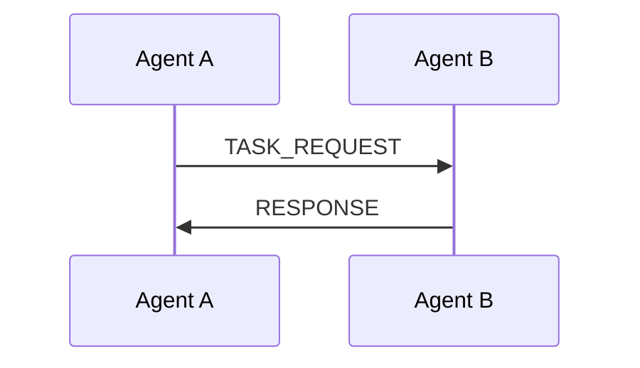
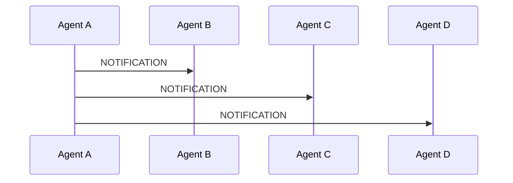
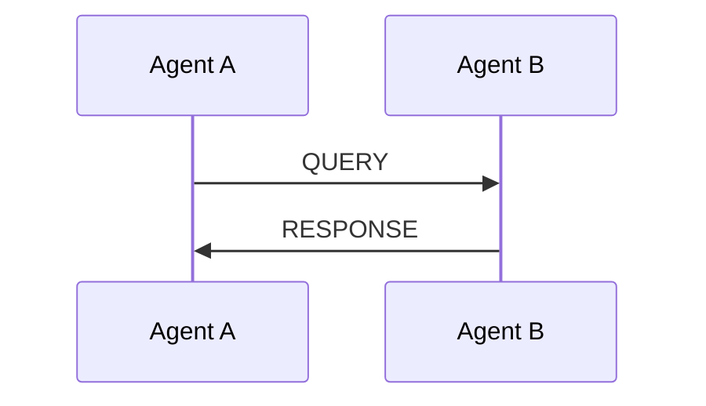

# A2A Communication Protocol

## Overview

The Agent-to-Agent (A2A) Communication Protocol enables seamless communication between AI agents in The New Fuse platform. This document provides a comprehensive overview of the protocol, its versions, message formats, and integration with the workflow builder.

The A2A protocol is designed to facilitate various communication patterns between agents, including direct communication, broadcast communication, and request-response patterns. It supports multiple protocol versions for backward compatibility and future extensibility.

## Protocol Versions

The A2A protocol supports multiple versions to accommodate different use cases and backward compatibility:

### Version 1.0 (Flat Structure)

The original A2A protocol version uses a flat message structure:

```typescript
interface A2AMessageV1 {
  id: string;
  type: string;
  timestamp: number;
  sender: string;
  recipient?: string;
  payload: any;
  metadata: {
    priority: 'low' | 'medium' | 'high';
    timeout?: number;
    retryCount?: number;
    protocol_version: '1.0';
  };
}
```

### Version 2.0 (Header/Body Structure)

The enhanced A2A protocol version uses a header/body structure for better organization:

```typescript
interface A2AMessageV2 {
  header: {
    id: string;
    type: string;
    version: string;
    priority: 'low' | 'medium' | 'high';
    source: string;
    target?: string;
  };
  body: {
    content: any;
    metadata: {
      sent_at: number;
      timeout?: number;
      retries?: number;
      trace_id?: string;
    };
  };
}
```

## Message Types

The A2A protocol supports various message types for different communication patterns:

- **TASK_REQUEST**: Request an agent to perform a task
- **QUERY**: Request information from an agent
- **RESPONSE**: Response to a request
- **NOTIFICATION**: One-way notification
- **ERROR**: Error message
- **HEARTBEAT**: Connection maintenance
- **CAPABILITY_DISCOVERY**: Agent capability discovery
- **WORKFLOW_STEP**: Workflow execution step

## Communication Patterns

The A2A protocol supports several communication patterns:

### Direct Communication

One-to-one communication between agents:



### Broadcast Communication

One-to-many communication:



### Request-Response

Synchronous communication with response:



## Security Features

The A2A protocol includes several security features:

- **End-to-End Encryption**: Messages can be encrypted for secure communication
- **Message Signing**: Messages can be signed to verify authenticity
- **Access Control**: Agents can control which other agents can communicate with them
- **Rate Limiting**: Prevents message flooding

## Workflow Builder Integration

The A2A protocol is integrated with the workflow builder through the following components:

### A2A Protocol Service

The A2AProtocolService (located in `apps/frontend/src/services/A2AProtocolService.ts`) provides methods for A2A protocol operations:

- `createMessage()`: Create a new A2A message
- `transformMessage()`: Transform a message between protocol versions
- `validateMessage()`: Validate a message against the schema
- `sendMessage()`: Send a message to an agent
- `broadcastMessage()`: Broadcast a message to multiple agents
- `sendRequestAndWaitForResponse()`: Send a request and wait for a response

The service uses Zod for schema validation and supports both v1.0 and v2.0 protocol versions.

### A2A Node Components

The A2A node in the workflow builder allows users to configure A2A communication:

- **A2ANodeComponent** (`src/components/workflow/A2ANodeComponent.tsx`): Visual representation of the A2A node in the workflow canvas
- **A2AConfigPanel** (`src/components/workflow/A2AConfigPanel.tsx`): Configuration panel for A2A nodes
- **a2a-node** (`apps/frontend/src/components/workflow/nodes/a2a-node.tsx`): Enhanced implementation with the latest features

These components allow users to:
- Select agent types (Task Execution, Data Processing, Coordination)
- Configure security levels
- Set protocol version
- Define message types and payloads

### Workflow Execution

The workflow execution is handled by several components:

- **A2AWorkflowExecutor** (`src/workflow/A2AWorkflowExecutor.ts`): Executes workflows with A2A nodes
- **A2AWorkflowService** (`src/services/A2AWorkflowService.ts`): Manages A2A workflow execution
- **WorkflowExecutionService** (`apps/frontend/src/services/WorkflowExecutionService.ts`): Provides high-level workflow execution capabilities

During execution, these components:
1. Create A2A messages based on node configuration
2. Send messages using the A2A protocol service
3. Handle responses and errors
4. Provide real-time status updates

## Implementation

The A2A protocol is implemented through several components across the codebase:

### Core Components

- **A2AProtocolService**: Core service for A2A protocol operations with Zod schema validation
- **ProtocolHandler** (`src/protocols/ProtocolHandler.ts`): Handles protocol operations and bridges to Python agents
- **A2ANode** (`src/workflow/nodes/A2ANode.ts`): Workflow node for A2A communication
- **A2AWorkflowExecutor** (`src/workflow/A2AWorkflowExecutor.ts`): Executes workflows with A2A nodes
- **A2AWorkflowService** (`src/services/A2AWorkflowService.ts`): Manages A2A workflow execution

### Supporting Services

- **A2ASchemaDocumentation** (`src/services/A2ASchemaDocumentation.ts`): Provides documentation for A2A schemas
- **A2AServiceDiscovery** (`src/services/A2AServiceDiscovery.ts`): Discovers available A2A services
- **AgentCapabilityService** (`src/services/AgentCapabilityService.ts`): Discovers agent capabilities
- **SecurityManager** (`src/protocols/SecurityManager.ts`): Handles message encryption and security

### Configuration

- **A2AConfig** (`src/config/A2AConfig.ts`): Configuration for A2A protocol
- **ConfigurationManager**: Manages A2A configuration settings

### Integration

- **useA2ACommunication** (`apps/frontend/src/hooks/useA2ACommunication.ts`): React hook for A2A communication
- **A2AModule** (`src/modules/A2AModule.ts`): NestJS module for A2A integration

## Usage Examples

### Creating and Sending an A2A Message

Using the A2AProtocolService to create and send messages:

```typescript
import { a2aProtocolService } from '@/services/A2AProtocolService';

// Create and send an A2A message (v2.0)
const message = a2aProtocolService.createMessage(
  'TASK_REQUEST',
  { task: 'analyze-data' },
  'workflow',
  'agent-1',
  {
    priority: 'high',
    timeout: 30000,
    retryCount: 3,
    protocolVersion: '2.0'
  }
);

// Send the message
await a2aProtocolService.sendMessage(message);

// Or broadcast to multiple agents
await a2aProtocolService.broadcastMessage(message);

// Or send a request and wait for response
const response = await a2aProtocolService.sendRequestAndWaitForResponse(message, 30000);
```

### Using the A2A React Hook

Using the useA2ACommunication hook in React components:

```typescript
import { useA2ACommunication } from '@/hooks/useA2ACommunication';

function AgentCommunicationComponent() {
  const {
    agents,
    messages,
    loading,
    error,
    sendMessage,
    broadcastMessage
  } = useA2ACommunication();

  const handleSendMessage = async () => {
    await sendMessage('TASK_REQUEST', { task: 'analyze-data' }, 'agent-1');
  };

  return (
    <div>
      {/* Component UI */}
    </div>
  );
}
```

### Configuring an A2A Node in the Workflow Builder

Configuring an A2A node in the workflow builder:

```typescript
// Configure an A2A node
const a2aNodeConfig = {
  id: 'node-1',
  type: 'A2A_AGENT',
  agentType: 'TASK_EXECUTION',
  securityLevel: 'high',
  protocolVersion: '2.0',
  inputs: ['input', 'context', 'configuration'],
  outputs: ['result', 'error', 'status'],
  timeout: 30000,
  retryCount: 3,
  priority: 'high'
};

// Register the node with the workflow service
const registeredNode = await a2aWorkflowService.registerA2ANode(a2aNodeConfig);
```

## References

For more information, refer to:

### Documentation
- [Workflow Builder Documentation](../workflow-builder.md)
- [MCP Integration Guide](mcp-integration.md)
- [A2A API Reference](../reference/a2a-api.md)
- [Agent Interaction Configuration Guide](../AgentInteractionConfig.md)
- [AI Agent Ecosystem](../AIAgentEcosystem.md)
- [Task Orchestration and Workflow Management](../TaskOrchestration.md)

### Implementation Files
- [A2AProtocolService](../../apps/frontend/src/services/A2AProtocolService.ts)
- [A2ANodeComponent](../../src/components/workflow/A2ANodeComponent.tsx)
- [A2AConfigPanel](../../src/components/workflow/A2AConfigPanel.tsx)
- [A2ANode](../../src/workflow/nodes/A2ANode.ts)
- [A2AWorkflowExecutor](../../src/workflow/A2AWorkflowExecutor.ts)
- [A2AWorkflowService](../../src/services/A2AWorkflowService.ts)
- [A2AConfig](../../src/config/A2AConfig.ts)
- [Protocol Types](../../src/protocols/types.ts)
