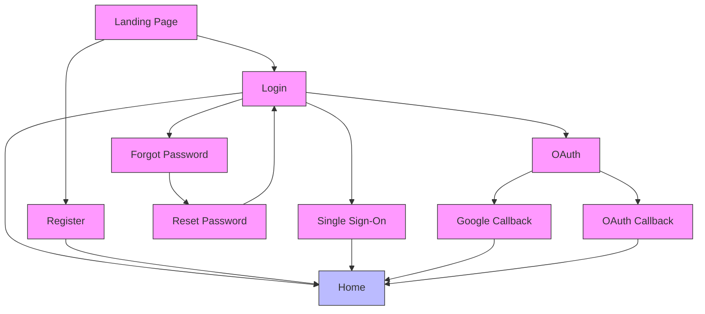

# The New Fuse - Application Structure Diagrams

This document provides visual representations of The New Fuse application structure using Mermaid diagrams.

## Main Navigation Structure

```mermaid
graph TD
    Home[Home] --> Dashboard[Dashboard]
    Home --> Workspace[Workspace]
    Home --> AIAgentPortal[AI Agent Portal]
    Home --> Settings[Settings]
    Home --> Admin[Admin Panel]
    
    Dashboard --> DashAgents[Agents]
    Dashboard --> DashAnalytics[Analytics]
    Dashboard --> DashSettings[Settings]
    
    DashAgents --> AgentDetails[Agent Details]
    DashAgents --> NewAgent[New Agent]
    
    Workspace --> WorkspaceOverview[Overview]
    Workspace --> WorkspaceAnalytics[Analytics]
    Workspace --> WorkspaceMembers[Members]
    Workspace --> WorkspaceSettings[Settings]
    Workspace --> WorkspaceChat[Chat]
    
    AIAgentPortal --> AgentMarketplace[Agent Marketplace]
    AIAgentPortal --> AgentCreationStudio[Creation Studio]
    AIAgentPortal --> AgentTrainingArena[Training Arena]
    AIAgentPortal --> AgentWorkflowManager[Workflow Manager]
    
    Settings --> GeneralSettings[General]
    Settings --> EmbeddingPreferences[Embedding Preferences]
    
    Admin --> AdminDashboard[Dashboard]
    Admin --> AdminUsers[Users]
    Admin --> AdminWorkspaces[Workspaces]
    Admin --> SystemHealth[System Health]
    Admin --> AdminSettings[Settings]
    Admin --> AdminAgents[Agents]
    Admin --> ExperimentalFeatures[Experimental Features]
    
    AdminAgents --> AgentSkills[Skills]
    
    classDef page fill:#f9f,stroke:#333,stroke-width:1px;
    classDef section fill:#bbf,stroke:#333,stroke-width:1px;
    
    class Home,Dashboard,Workspace,AIAgentPortal,Settings,Admin section;
    class DashAgents,DashAnalytics,DashSettings,WorkspaceOverview,WorkspaceAnalytics,WorkspaceMembers,WorkspaceSettings,WorkspaceChat,AgentMarketplace,AgentCreationStudio,AgentTrainingArena,AgentWorkflowManager,GeneralSettings,EmbeddingPreferences,AdminDashboard,AdminUsers,AdminWorkspaces,SystemHealth,AdminSettings,AdminAgents,ExperimentalFeatures,AgentDetails,NewAgent,AgentSkills page;
```

## Authentication Flow

## Component Hierarchy

```mermaid
graph TD
    App[App] --> MainLayout[Main Layout]
    MainLayout --> Header[Header]
    MainLayout --> Sidebar[Sidebar]
    MainLayout --> Footer[Footer]
    MainLayout --> ContentArea[Content Area]
    
    ContentArea --> Pages[Pages]
    ContentArea --> Modals[Modals]
    ContentArea --> Notifications[Notifications]
    
    Pages --> AuthPages[Auth Pages]
    Pages --> MainPages[Main Pages]
    Pages --> AdminPages[Admin Pages]
    Pages --> FeaturePages[Feature Pages]
    
    AuthPages --> Login[Login]
    AuthPages --> Register[Register]
    AuthPages --> ForgotPassword[Forgot Password]
    AuthPages --> ResetPassword[Reset Password]
    
    MainPages --> Dashboard[Dashboard]
    MainPages --> Workspace[Workspace]
    MainPages --> AIAgentPortal[AI Agent Portal]
    MainPages --> Settings[Settings]
    
    AdminPages --> AdminDashboard[Admin Dashboard]
    AdminPages --> UserManagement[User Management]
    AdminPages --> SystemHealth[System Health]
    
    FeaturePages --> ChatRoom[Chat Room]
    FeaturePages --> PromptWorkbench[Prompt Workbench]
    FeaturePages --> WorkflowEditor[Workflow Editor]
    FeaturePages --> KnowledgeBaseEditor[Knowledge Base Editor]
    
    Modals --> SettingsModal[Settings Modal]
    Modals --> AgentConfigModal[Agent Config Modal]
    Modals --> PromptSaveModal[Prompt Save Modal]
    
    Notifications --> Toast[Toast]
    Notifications --> AlertDialog[Alert Dialog]
    
    classDef container fill:#bbf,stroke:#333,stroke-width:1px;
    classDef component fill:#f9f,stroke:#333,stroke-width:1px;
    classDef page fill:#bfb,stroke:#333,stroke-width:1px;
    
    class App,MainLayout,ContentArea,Pages,Modals,Notifications,AuthPages,MainPages,AdminPages,FeaturePages container;
    class Header,Sidebar,Footer,Toast,AlertDialog component;
    class Login,Register,ForgotPassword,ResetPassword,Dashboard,Workspace,AIAgentPortal,Settings,AdminDashboard,UserManagement,SystemHealth,ChatRoom,PromptWorkbench,WorkflowEditor,KnowledgeBaseEditor,SettingsModal,AgentConfigModal,PromptSaveModal page;
```

## Core UI Components

```mermaid
graph TD
    UIComponents[UI Components] --> BaseComponents[Base Components]
    UIComponents --> LayoutComponents[Layout Components]
    UIComponents --> FeatureComponents[Feature Components]
    
    BaseComponents --> Button[Button]
    BaseComponents --> Card[Card]
    BaseComponents --> Dialog[Dialog/Modal]
    BaseComponents --> Input[Input]
    BaseComponents --> Select[Select]
    BaseComponents --> Checkbox[Checkbox]
    BaseComponents --> Switch[Switch]
    BaseComponents --> DropdownMenu[Dropdown Menu]
    BaseComponents --> Toast[Toast]
    BaseComponents --> Tabs[Tabs]
    BaseComponents --> Avatar[Avatar]
    BaseComponents --> Badge[Badge]
    BaseComponents --> Form[Form]
    BaseComponents --> Progress[Progress]
    BaseComponents --> Slider[Slider]
    BaseComponents --> Textarea[Textarea]
    BaseComponents --> DataTable[Data Table]
    BaseComponents --> ScrollArea[Scroll Area]
    
    LayoutComponents --> MainLayout[Main Layout]
    LayoutComponents --> AppLayout[App Layout]
    LayoutComponents --> Sidebar[Sidebar]
    LayoutComponents --> Header[Header]
    LayoutComponents --> Footer[Footer]
    LayoutComponents --> Navigation[Navigation]
    
    FeatureComponents --> AgentComponents[Agent Components]
    FeatureComponents --> ChatComponents[Chat Components]
    FeatureComponents --> WorkflowComponents[Workflow Components]
    FeatureComponents --> DashboardComponents[Dashboard Components]
    FeatureComponents --> AdminComponents[Admin Components]
    FeatureComponents --> PromptComponents[Prompt/AI Components]
    FeatureComponents --> KnowledgeComponents[Knowledge Components]
    
    classDef category fill:#bbf,stroke:#333,stroke-width:1px;
    classDef component fill:#f9f,stroke:#333,stroke-width:1px;
    classDef featureCategory fill:#bfb,stroke:#333,stroke-width:1px;
    
    class UIComponents,BaseComponents,LayoutComponents,FeatureComponents category;
    class Button,Card,Dialog,Input,Select,Checkbox,Switch,DropdownMenu,Toast,Tabs,Avatar,Badge,Form,Progress,Slider,Textarea,DataTable,ScrollArea,MainLayout,AppLayout,Sidebar,Header,Footer,Navigation component;
    class AgentComponents,ChatComponents,WorkflowComponents,DashboardComponents,AdminComponents,PromptComponents,KnowledgeComponents featureCategory;
```

## Agent Components

```mermaid
graph TD
    AgentComponents[Agent Components] --> AgentCard[Agent Card]
    AgentComponents --> AgentChatRoom[Agent Chat Room]
    AgentComponents --> AgentCreationStudio[Agent Creation Studio]
    AgentComponents --> AgentMarketplace[Agent Marketplace]
    AgentComponents --> AgentWorkflowManager[Agent Workflow Manager]
    AgentComponents --> AgentPersonalityCustomizer[Agent Personality Customizer]
    AgentComponents --> AgentSelector[Agent Selector]
    AgentComponents --> AgentSkillMarketplace[Agent Skill Marketplace]
    AgentComponents --> AgentTrainingArena[Agent Training Arena]
    AgentComponents --> AgentNetwork[Agent Network]
    AgentComponents --> AgentDetails[Agent Details]
    AgentComponents --> AgentMessage[Agent Message]
    AgentComponents --> AgentCollaborationDashboard[Agent Collaboration Dashboard]
    AgentComponents --> AgentConfigModal[Agent Config Modal]
    AgentComponents --> AgentFilters[Agent Filters]
    AgentComponents --> AgentForm[Agent Form]
    AgentComponents --> AgentList[Agent List]
    AgentComponents --> AgentLogs[Agent Logs]
    AgentComponents --> AgentMetrics[Agent Metrics]
    AgentComponents --> AgentSearch[Agent Search]
    AgentComponents --> AgentSettings[Agent Settings]
    AgentComponents --> AgentStatus[Agent Status]
    AgentComponents --> AgentTasks[Agent Tasks]
    
    classDef component fill:#f9f,stroke:#333,stroke-width:1px;
    classDef category fill:#bbf,stroke:#333,stroke-width:1px;
    
    class AgentComponents category;
    class AgentCard,AgentChatRoom,AgentCreationStudio,AgentMarketplace,AgentWorkflowManager,AgentPersonalityCustomizer,AgentSelector,AgentSkillMarketplace,AgentTrainingArena,AgentNetwork,AgentDetails,AgentMessage,AgentCollaborationDashboard,AgentConfigModal,AgentFilters,AgentForm,AgentList,AgentLogs,AgentMetrics,AgentSearch,AgentSettings,AgentStatus,AgentTasks component;
```

## Chat Components

```mermaid
graph TD
    ChatComponents[Chat Components] --> ChatRoom[Chat Room]
    ChatComponents --> ChatInterface[Chat Interface]
    ChatComponents --> ChatWindow[Chat Window]
    ChatComponents --> MessageBubble[Message Bubble]
    ChatComponents --> EnhancedChatBubble[Enhanced Chat Bubble]
    ChatComponents --> TypingIndicator[Typing Indicator]
    ChatComponents --> MessageThread[Message Thread]
    ChatComponents --> MessageSearch[Message Search]
    ChatComponents --> ChatInput[Chat Input]
    ChatComponents --> ChatMessage[Chat Message]
    ChatComponents --> MessageReactions[Message Reactions]
    ChatComponents --> ChatContext[Chat Context]
    
    classDef component fill:#f9f,stroke:#333,stroke-width:1px;
    classDef category fill:#bbf,stroke:#333,stroke-width:1px;
    
    class ChatComponents category;
    class ChatRoom,ChatInterface,ChatWindow,MessageBubble,EnhancedChatBubble,TypingIndicator,MessageThread,MessageSearch,ChatInput,ChatMessage,MessageReactions,ChatContext component;
```

## Workflow Components

```mermaid
graph TD
    WorkflowComponents[Workflow Components] --> WorkflowCanvas[Workflow Canvas]
    WorkflowComponents --> WorkflowToolbar[Workflow Toolbar]
    WorkflowComponents --> NodeInspector[Node Inspector]
    WorkflowComponents --> NodeLibrary[Node Library]
    WorkflowComponents --> NodeCategory[Node Category]
    WorkflowComponents --> ExecutionOverlay[Execution Overlay]
    WorkflowComponents --> DynamicNode[Dynamic Node]
    WorkflowComponents --> CodeEditor[Code Editor]
    WorkflowComponents --> CollectionEditor[Collection Editor]
    WorkflowComponents --> CredentialSelector[Credential Selector]
    WorkflowComponents --> AIProcessingNode[AI Processing Node]
    WorkflowComponents --> HTTPRequestNode[HTTP Request Node]
    WorkflowComponents --> SlackNode[Slack Node]
    WorkflowComponents --> WorkflowEditor[Workflow Editor]
    WorkflowComponents --> WorkflowEngine[Workflow Engine]
    WorkflowComponents --> WorkflowControls[Workflow Controls]
    WorkflowComponents --> WorkflowError[Workflow Error]
    WorkflowComponents --> WorkflowProgress[Workflow Progress]
    WorkflowComponents --> WorkflowStepViewer[Workflow Step Viewer]
    WorkflowComponents --> WorkflowVisualizer[Workflow Visualizer]
    
    classDef component fill:#f9f,stroke:#333,stroke-width:1px;
    classDef category fill:#bbf,stroke:#333,stroke-width:1px;
    
    class WorkflowComponents category;
    class WorkflowCanvas,WorkflowToolbar,NodeInspector,NodeLibrary,NodeCategory,ExecutionOverlay,DynamicNode,CodeEditor,CollectionEditor,CredentialSelector,AIProcessingNode,HTTPRequestNode,SlackNode,WorkflowEditor,WorkflowEngine,WorkflowControls,WorkflowError,WorkflowProgress,WorkflowStepViewer,WorkflowVisualizer component;
```

## Dashboard Components

```mermaid
graph TD
    DashboardComponents[Dashboard Components] --> PerformanceDashboard[Performance Dashboard]
    DashboardComponents --> UserDashboard[User Dashboard]
    DashboardComponents --> ModerationDashboard[Moderation Dashboard]
    DashboardComponents --> AgentMonitoringDashboard[Agent Monitoring Dashboard]
    DashboardComponents --> Dashboard[Dashboard]
    DashboardComponents --> DashboardGrid[Dashboard Grid]
    DashboardComponents --> DashboardProvider[Dashboard Provider]
    DashboardComponents --> DashboardRoot[Dashboard Root]
    DashboardComponents --> ChartWidget[Chart Widget]
    DashboardComponents --> ListWidget[List Widget]
    DashboardComponents --> TableWidget[Table Widget]
    DashboardComponents --> MetricCard[Metric Card]
    DashboardComponents --> FeatureControls[Feature Controls]
    DashboardComponents --> DataMappingModal[Data Mapping Modal]
    DashboardComponents --> WidgetConfigModal[Widget Config Modal]
    DashboardComponents --> ShareDashboardModal[Share Dashboard Modal]
    DashboardComponents --> ActivityFeed[Activity Feed]
    DashboardComponents --> CommentThread[Comment Thread]
    DashboardComponents --> ChartComponent[Chart Component]
    DashboardComponents --> DataGrid[Data Grid]
    DashboardComponents --> DashboardContext[Dashboard Context]
    
    classDef component fill:#f9f,stroke:#333,stroke-width:1px;
    classDef category fill:#bbf,stroke:#333,stroke-width:1px;
    
    class DashboardComponents category;
    class PerformanceDashboard,UserDashboard,ModerationDashboard,AgentMonitoringDashboard,Dashboard,DashboardGrid,DashboardProvider,DashboardRoot,ChartWidget,ListWidget,TableWidget,MetricCard,FeatureControls,DataMappingModal,WidgetConfigModal,ShareDashboardModal,ActivityFeed,CommentThread,ChartComponent,DataGrid,DashboardContext component;
```

## File Structure Overview

```mermaid
graph TD
    Root[The New Fuse] --> Apps[apps/]
    Root --> Packages[packages/]
    Root --> Docs[docs/]
    Root --> Src[src/]
    
    Apps --> Frontend[frontend/]
    
    Frontend --> SrcFrontend[src/]
    
    SrcFrontend --> Components[components/]
    SrcFrontend --> Pages[pages/]
    SrcFrontend --> Contexts[contexts/]
    SrcFrontend --> Hooks[hooks/]
    SrcFrontend --> Utils[utils/]
    SrcFrontend --> Lib[lib/]
    SrcFrontend --> Providers[providers/]
    SrcFrontend --> Routes[routes/]
    SrcFrontend --> Shared[shared/]
    
    Pages --> AuthPages[auth/]
    Pages --> AdminPages[Admin/]
    Pages --> DashboardPages[dashboard/]
    Pages --> WorkspacePages[workspace/]
    Pages --> SettingsPages[settings/]
    Pages --> LegalPages[legal/]
    
    Components --> AdminComponents[AdminPanel/]
    Components --> AgentComponents[agent components]
    Components --> ChatComponents[chat/]
    Components --> WorkflowComponents[WorkflowEditor/]
    Components --> PromptComponents[PromptWorkbench/]
    Components --> UIComponents[ui/]
    Components --> SharedComponents[shared/]
    Components --> FeatureComponents[features/]
    
    Packages --> UIComponents[ui-components/]
    Packages --> UI[ui/]
    Packages --> Core[core/]
    Packages --> Features[features/]
    Packages --> Shared[shared/]
    Packages --> Layout[layout/]
    
    UIComponents --> CoreUI[src/core/]
    UIComponents --> FeaturesUI[src/features/]
    UIComponents --> LayoutUI[src/layout/]
    
    CoreUI --> Button[button/]
    CoreUI --> Card[card/]
    CoreUI --> Dialog[dialog/]
    CoreUI --> Input[input/]
    CoreUI --> Select[select/]
    
    FeaturesUI --> ChatFeatures[chat/]
    FeaturesUI --> WorkflowFeatures[workflow/]
    
    Features --> AgentsFeatures[agents/]
    Features --> ChatFeatures2[chat/]
    Features --> DashboardFeatures[dashboard/]
    Features --> ThemeFeatures[theme/]
    Features --> WorkspaceFeatures[workspace/]
    Features --> AIFeatures[ai/]
    Features --> AuthFeatures[auth/]
    Features --> CollaborationFeatures[collaboration/]
    Features --> MarketplaceFeatures[marketplace/]
    
    classDef folder fill:#bbf,stroke:#333,stroke-width:1px;
    classDef component fill:#f9f,stroke:#333,stroke-width:1px;
    
    class Root,Apps,Packages,Docs,Src,Frontend,SrcFrontend,Components,Pages,Contexts,Hooks,Utils,Lib,Providers,Routes,Shared,AuthPages,AdminPages,DashboardPages,WorkspacePages,SettingsPages,LegalPages,AdminComponents,AgentComponents,ChatComponents,WorkflowComponents,PromptComponents,UIComponents,SharedComponents,FeatureComponents,UIComponents,UI,Core,Features,Shared,Layout,CoreUI,FeaturesUI,LayoutUI,Button,Card,Dialog,Input,Select,ChatFeatures,WorkflowFeatures,AgentsFeatures,ChatFeatures2,DashboardFeatures,ThemeFeatures,WorkspaceFeatures,AIFeatures,AuthFeatures,CollaborationFeatures,MarketplaceFeatures folder;
```

