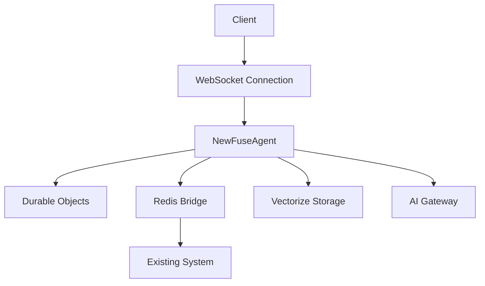

# Cloudflare Agents Integration

## Overview
This document outlines the integration of Cloudflare Agents into The New Fuse platform, enabling distributed AI agent execution with built-in state management, real-time communication, and scalable deployment capabilities.

## Architecture

### Components
- **NewFuseAgent**: Core agent implementation extending Cloudflare's Agent class
- **Durable Objects**: State persistence layer
- **Redis Bridge**: Communication layer between Cloudflare and existing systems
- **Vectorize Integration**: Memory and context management
- **AI Gateway**: Model interaction and rate limiting

### System Diagram


## Implementation Details

### Agent Configuration
```typescript
const agentConfig = {
  namespace: 'newfuse-agents',
  persistence: {
    type: 'durable-objects',
    database: true
  },
  communication: {
    websocket: true,
    redis: true
  }
};
```

### State Management
- Automatic state synchronization between Durable Objects and Redis
- Real-time state updates via WebSocket
- Persistent storage for long-running operations

### Communication Channels
1. **AI_COORDINATION_CHANNEL**: Agent coordination and system messages
2. **AI_TASK_CHANNEL**: Task distribution and assignment
3. **AI_RESULT_CHANNEL**: Task completion and results

## Deployment

### Prerequisites
- Cloudflare Workers account
- Wrangler CLI installed
- Access to Cloudflare AI Gateway
- Redis instance configured

### Deployment Steps
1. Install dependencies:
   ```bash
   npm install agents @cloudflare/workers-types
   ```

2. Configure Wrangler:
   ```toml
   name = "newfuse-agents"
   main = "src/index.ts"
   compatibility_date = "2024-01-01"

   [durable_objects]
   bindings = [
     { name = "AGENT_STORAGE", class_name = "AgentStorage" }
   ]
   ```

3. Deploy:
   ```bash
   npx wrangler deploy
   ```

## Security Considerations

### Authentication
- JWT-based authentication for agent access
- Rate limiting via AI Gateway
- Request signing for inter-service communication

### Data Protection
- End-to-end encryption for sensitive data
- Secure state persistence in Durable Objects
- Encrypted communication channels

## Monitoring

### Metrics
- Request latency
- Agent state changes
- Task completion rates
- Error rates
- Resource utilization

### Logging
- Agent lifecycle events
- State transitions
- Communication events
- Error tracking

## Migration Strategy

### Phase 1: Initial Setup
- Deploy Cloudflare infrastructure
- Implement basic agent functionality
- Set up monitoring

### Phase 2: Gradual Migration
- Migrate agents one at a time
- Validate performance and stability
- Monitor for issues

### Phase 3: Full Integration
- Complete migration of all agents
- Decommission legacy systems
- Optimize performance

## API Reference

### Agent Methods
```typescript
class NewFuseAgent extends Agent {
  async initialize(): Promise<void>
  async handleTask(task: Task): Promise<void>
  async executeTask(task: Task): Promise<Result>
}
```

### State Management
```typescript
interface AgentState {
  id: string;
  status: 'active' | 'inactive';
  capabilities: string[];
  metrics: {
    requestsHandled: number;
    lastActive: number;
  };
}
```

## Troubleshooting

### Common Issues
1. **Connection Failures**
   - Verify WebSocket configuration
   - Check Redis connectivity
   - Validate authentication tokens

2. **State Synchronization**
   - Monitor Durable Objects status
   - Check Redis pub/sub channels
   - Verify state schema

3. **Performance Issues**
   - Review AI Gateway metrics
   - Check resource utilization
   - Monitor task queue length

## Future Improvements

### Planned Features
- Enhanced vector search capabilities
- Advanced task scheduling
- Improved error recovery
- Extended monitoring capabilities

### Performance Optimizations
- Caching improvements
- State synchronization optimization
- Communication protocol enhancements

## Support and Resources

### Documentation
- [Cloudflare Agents SDK](https://developers.cloudflare.com/agents)
- [Durable Objects](https://developers.cloudflare.com/workers/learning/using-durable-objects)
- [AI Gateway](https://developers.cloudflare.com/ai-gateway)

### Support Channels
- Internal Support: #cloudflare-support
- External Support: support@newfuse.com
- Emergency Contact: ops@newfuse.com