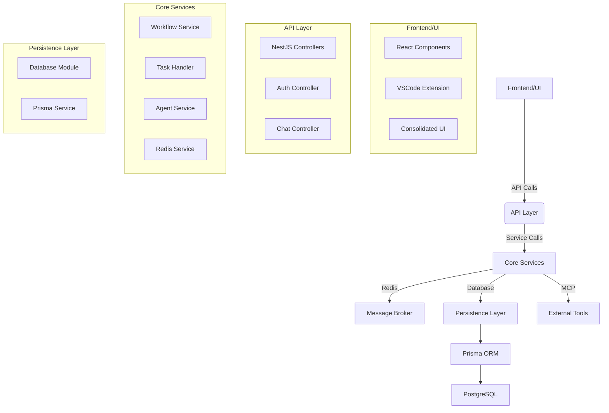
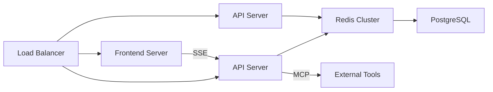

# Codebase Architecture Overview

## 1. High-Level Architecture

## 2. Key Components & Relationships

### 2.1 Presentation Layer
- **React Components**: Located in `src/components` and `packages/ui-components`
- **VSCode Extension**: Comprehensive IDE integration in `src/vscode-extension`
- **Consolidated UI**: Unified interface components in `packages/ui-consolidated`

### 2.2 API Layer
- **NestJS Controllers**: REST API endpoints in `src/controllers`
- **Authentication**: JWT-based auth with middleware in `src/middleware/auth`
- **WebSockets**: Real-time communication in `src/websocket`

### 2.3 Core Services
- **Workflow Engine**: `src/workflow/WorkflowEngine.ts` and related modules
- **Task Management**: `src/task/TaskService.tsx` and `src/services/workflowExecutionService.tsx`
- **Redis Integration**: `src/redis/redis.service.tsx` for message brokering
- **MCP Integration**: `src/mcp` directory for Model Context Protocol servers

### 2.4 Persistence Layer
- **Prisma ORM**: `packages/database/src/prisma.service.ts` as the main ORM layer
- **Data Models**: Defined in `prisma/schema.prisma`
- **Repositories**: Type-safe data access in `packages/database/src/repositories`

## 3. Technology Stack
- **Frontend**: React, TypeScript, WebSockets
- **Backend**: NestJS, TypeScript, Redis
- **Database**: PostgreSQL with Prisma ORM
- **Infrastructure**: Docker, Kubernetes, MCP
- **Security**: JWT, MFA, Rate Limiting

## 4. Service Boundaries & Communication
- **Internal Communication**: REST APIs and WebSockets between frontend and backend
- **External Integration**: MCP servers for tool integration
- **Message Brokering**: Redis for asynchronous communication
- **Data Flow**: 
  1. User interaction in UI
  2. API layer validation
  3. Core service processing
  4. Database persistence
  5. Optional external tool integration via MCP

## 5. Notable Design Patterns
- **Microservices Architecture**: Separated concerns between UI, API, core services
- **Dependency Injection**: Used throughout NestJS components
- **Event-Driven Architecture**: Redis-based event streaming
- **CQRS Pattern**: Separated query and command operations
- **Circuit Breaker**: Implemented in Redis communication
- **Adapter Pattern**: MCP integration layer

## 6. Security Architecture
- **Authentication**: JWT tokens with refresh mechanism
- **Authorization**: Role-based access control
- **Data Protection**: Encryption in transit (TLS) and at rest
- **Rate Limiting**: `packages/core/src/security/RateLimiter.tsx`
- **Audit Logging**: Comprehensive logging in `src/logging.ts`

## 7. Deployment Architecture

This architecture document provides a comprehensive overview of the system's structure, components, and relationships. It highlights the key technical decisions and patterns used throughout the codebase.