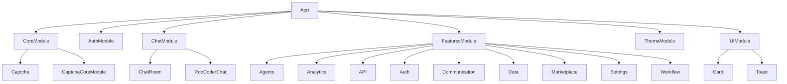
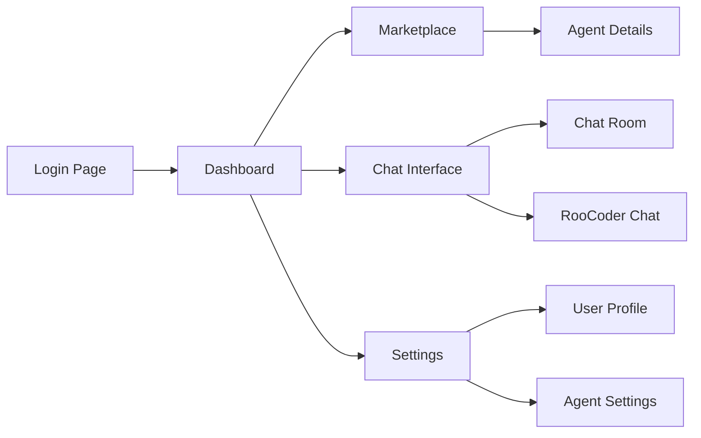
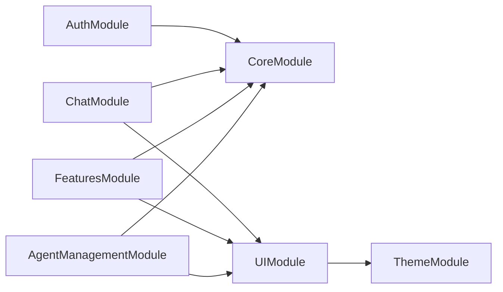
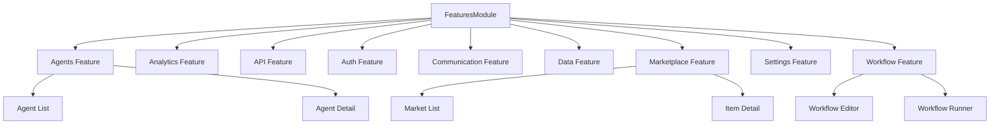

# Component Architecture Diagrams

## Component Hierarchy

```mermaid
graph TD
    App --> CoreModule
    App --> AuthModule
    App --> ChatModule
    App --> FeaturesModule
    App --> ThemeModule
    App --> UIModule

    CoreModule --> Captcha
    CoreModule --> CaptchaCoreModule

    FeaturesModule --> Agents
    FeaturesModule --> Analytics
    FeaturesModule --> API
    FeaturesModule --> Auth
    FeaturesModule --> Communication
    FeaturesModule --> Data
    FeaturesModule --> Marketplace
    FeaturesModule --> Settings
    FeaturesModule --> Workflow

    ChatModule --> ChatRoom
    ChatModule --> RooCoderChat

    UIModule --> Card
    UIModule --> Toast
```

## Navigation Flow

```mermaid
flowchart LR
    Login[Login Page] --> Dashboard[Dashboard]
    Dashboard --> Marketplace[Marketplace]
    Dashboard --> Chat[Chat Interface]
    Dashboard --> Settings[Settings]
    
    Chat --> ChatRoom[Chat Room]
    Chat --> RooCoderChat[RooCoder Chat]
    
    Marketplace --> AgentDetails[Agent Details]
    Settings --> UserProfile[User Profile]
    Settings --> AgentSettings[Agent Settings]
```

## Module Dependencies

```mermaid
graph LR
    AuthModule --> CoreModule
    ChatModule --> CoreModule
    FeaturesModule --> CoreModule
    UIModule --> ThemeModule
    
    ChatModule --> UIModule
    FeaturesModule --> UIModule
    
    AgentManagementModule --> CoreModule
    AgentManagementModule --> UIModule
```

## Feature Module Structure

```mermaid
graph TD
    FeaturesModule --> AgentsFeature[Agents Feature]
    FeaturesModule --> AnalyticsFeature[Analytics Feature]
    FeaturesModule --> APIFeature[API Feature]
    FeaturesModule --> AuthFeature[Auth Feature]
    FeaturesModule --> CommunicationFeature[Communication Feature]
    FeaturesModule --> DataFeature[Data Feature]
    FeaturesModule --> MarketplaceFeature[Marketplace Feature]
    FeaturesModule --> SettingsFeature[Settings Feature]
    FeaturesModule --> WorkflowFeature[Workflow Feature]

    AgentsFeature --> AgentList[Agent List]
    AgentsFeature --> AgentDetail[Agent Detail]
    
    MarketplaceFeature --> MarketList[Market List]
    MarketplaceFeature --> ItemDetail[Item Detail]
    
    WorkflowFeature --> WorkflowEditor[Workflow Editor]
    WorkflowFeature --> WorkflowRunner[Workflow Runner]
```