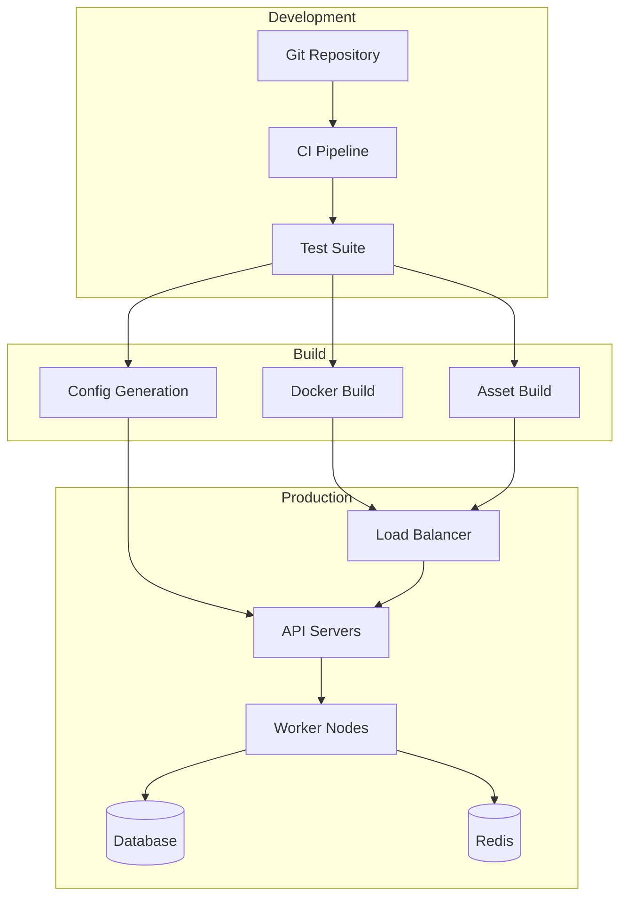

# Deployment Flow

```mermaid
graph TB
    subgraph Development
        Git[Git Repository]
        CI[CI Pipeline]
        Tests[Test Suite]
    end

    subgraph Build
        Docker[Docker Build]
        Assets[Asset Build]
        Config[Config Generation]
    end

    subgraph Production
        LB[Load Balancer]
        API[API Servers]
        Workers[Worker Nodes]
        DB[(Database)]
        Cache[(Redis)]
    end

    Git --> CI
    CI --> Tests
    Tests --> Docker
    Tests --> Assets
    Tests --> Config
    Docker --> LB
    Assets --> LB
    Config --> API
    LB --> API
    API --> Workers
    Workers --> DB
    Workers --> Cache
```