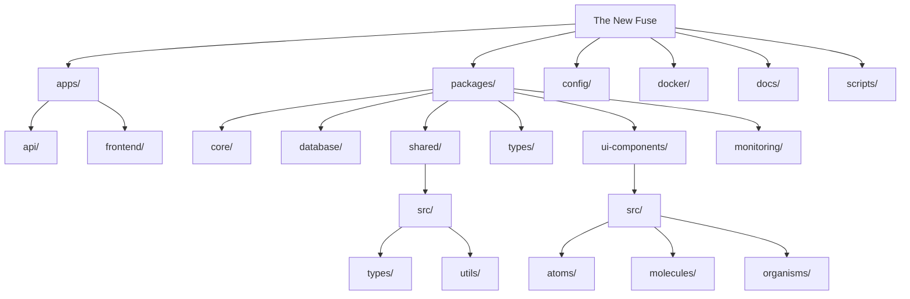

# Directory Structure

```mermaid
graph TD
    Root[The New Fuse] --> Apps[apps/]
    Root --> Packages[packages/]
    Root --> Config[config/]
    Root --> Docker[docker/]
    Root --> Docs[docs/]
    Root --> Scripts[scripts/]

    Apps --> ApiApp[api/]
    Apps --> FrontendApp[frontend/]

    Packages --> Core[core/]
    Packages --> Database[database/]
    Packages --> Shared[shared/]
    Packages --> Types[types/]
    Packages --> UI[ui-components/]
    Packages --> Monitoring[monitoring/]

    Shared --> SharedSrc[src/]
    SharedSrc --> SharedTypes[types/]
    SharedSrc --> SharedUtils[utils/]

    UI --> UISrc[src/]
    UISrc --> Atoms[atoms/]
    UISrc --> Molecules[molecules/]
    UISrc --> Organisms[organisms/]
```