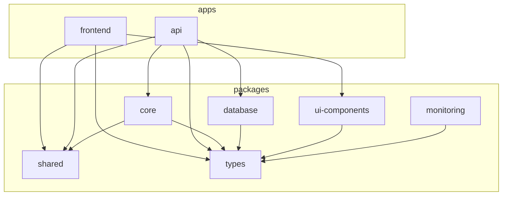

# Package Dependencies

```mermaid
graph TD
    subgraph apps
        frontend[frontend]
        api[api]
    end

    subgraph packages
        core[core]
        database[database]
        shared[shared]
        types[types]
        ui[ui-components]
        monitoring[monitoring]
    end

    frontend --> ui
    frontend --> shared
    frontend --> types
    api --> core
    api --> database
    api --> shared
    api --> types
    core --> types
    core --> shared
    database --> types
    ui --> types
    monitoring --> types
```