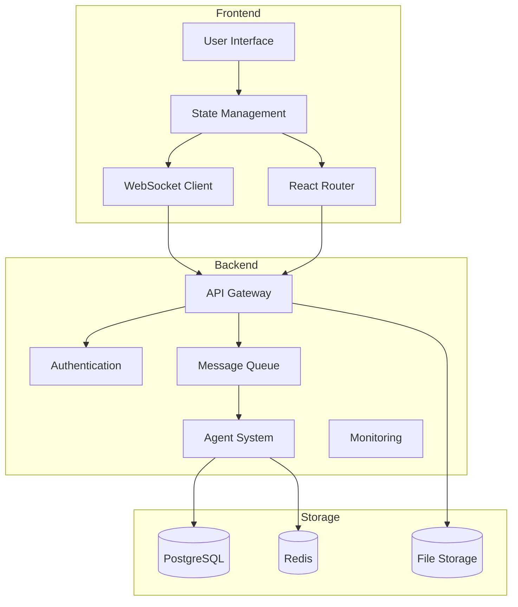

# System Architecture

```mermaid
graph TD
    subgraph Frontend
        UI[User Interface]
        State[State Management]
        WebSocket[WebSocket Client]
        Router[React Router]
    end

    subgraph Backend
        API[API Gateway]
        Auth[Authentication]
        Queue[Message Queue]
        Agents[Agent System]
        Monitor[Monitoring]
    end

    subgraph Storage
        DB[(PostgreSQL)]
        Cache[(Redis)]
        Files[(File Storage)]
    end

    UI --> State
    State --> WebSocket
    State --> Router
    WebSocket --> API
    Router --> API
    API --> Auth
    API --> Queue
    Queue --> Agents
    Agents --> DB
    Agents --> Cache
    API --> Files
```