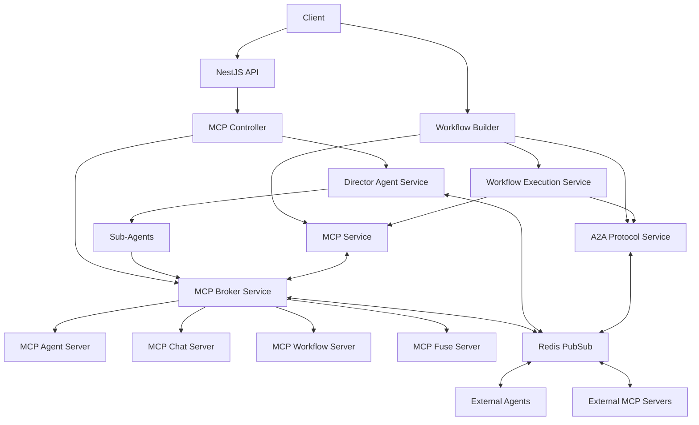

# MCP Integration Architecture

> **Note**: This document provides a high-level overview of the MCP integration architecture. For complete documentation of MCP implementation, features, and usage, please refer to the [Complete MCP Guide](../MCP-GUIDE.md).

## Overview

The Model Context Protocol (MCP) integration in The New Fuse follows a modular architecture that enables seamless communication between AI agents and tools. This document provides a high-level overview of the architecture.

## Key Components

The MCP integration consists of these core components:

- **Agent WebSocket Service**: Real-time agent communication
- **Workflow MCP Integration**: Workflow execution and tool management
- **A2A Communication Protocol**: Agent-to-agent communication with multiple protocol versions
- **Workflow Builder**: Visual editor for creating and executing workflows
- **Analytics Integration**: Performance tracking and metrics
- **Schema Validation**: Dynamic validation and migration
- **Workflow Monitoring**: Real-time status tracking
- **Agent Capability Discovery**: Dynamic capability management

For detailed implementation documentation of these components, please refer to the [Complete MCP Guide](../MCP-GUIDE.md).

## Architecture Diagram

## Next Steps

For detailed documentation on:
- Implementation details
- Configuration options
- Usage examples
- Security considerations
- Best practices
- Troubleshooting

Please refer to the [Complete MCP Guide](../MCP-GUIDE.md).
