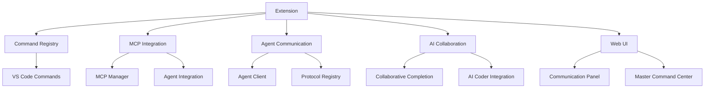

# The New Fuse Architecture Overview

This document provides a comprehensive overview of the architecture of The New Fuse inter-LLM communication framework.

## System Architecture

> **IMPORTANT**: This document is now superseded by the [Master Information Architecture](docs/MASTER_INFORMATION_ARCHITECTURE.md) document which serves as the single source of truth for all architectural patterns and data exchange mechanisms.

Please refer to the [Master Information Architecture](docs/MASTER_INFORMATION_ARCHITECTURE.md) for the most up-to-date and comprehensive documentation of:

- System Architecture
- Data Exchange Patterns
- Integration Standards
- Cross-Environment Communication
- Security Implementation
- Monitoring Requirements

This document will be maintained only for historical reference.

## Technology Stack

- **Backend**: Node.js, TypeScript, NestJS
- **State Management**: Redis
- **Database**: PostgreSQL with Prisma ORM
- **Communication**: WebSockets, REST APIs, gRPC
- **Frontend**: React, Material UI
- **Developer Tools**: VS Code Extension

## VS Code Extension

The New Fuse includes a VS Code extension that enables AI agent coordination and workflow automation directly in your development environment.

### Features

- **AI Agent Coordination**: Connect and coordinate multiple AI agents to collaborate on complex tasks
- **Multiple Communication Protocols**:
  - Workspace State Protocol: For extensions in the same VS Code window
  - File Protocol: For cross-window and cross-session communication
  - Command Protocol: For direct, synchronous messaging
  - Message Control Protocol (MCP): For standardized AI agent interactions
- **AI Collaboration**: Coordinate multiple AI agents to work together on tasks
- **Collaborative Code Completion**: Combine suggestions from multiple sources
- **Master Command Center**: Unified interface to control all AI communication

### Extension Architecture



## Key Design Principles

1. **Modularity**: Components are designed to be modular and independently deployable
2. **Extensibility**: The system can be extended with new capabilities and integrations
3. **Observability**: Comprehensive logging, monitoring, and tracing is built-in
4. **Resilience**: Fault tolerance and graceful degradation are core design goals
5. **Security**: Zero-trust architecture with authentication and authorization at each layer

## Component Details

### Agent System

The agent system provides a framework for AI models to register their capabilities and participate in workflows:

```typescript
interface Agent {
  id: string;
  name: string;
  description: string;
  capabilities: Capability[];
  register(): Promise<void>;
  handleRequest(request: Request): Promise<Response>;
  discoverCapabilities(): Promise<Capability[]>;
}
```

### Model Context Protocol (MCP)

MCP standardizes how context is shared between different AI models:

```typescript
interface MCPContext {
  conversationId: string;
  messages: Message[];
  metadata: Record<string, any>;
  capabilities: CapabilityRequest[];
}

interface Message {
  id: string;
  role: 'user' | 'assistant' | 'system';
  content: string;
  timestamp: Date;
  metadata?: Record<string, any>;
}
```

### Agent-to-Agent (A2A) Protocol

The A2A protocol enables direct communication between AI agents:

```typescript
interface A2AMessage {
  header: {
    id: string;
    type: string;
    version: string;
    priority: 'low' | 'medium' | 'high';
    source: string;
    target?: string;
  };
  body: {
    content: any;
    metadata: {
      sent_at: number;
      timeout?: number;
      retries?: number;
      trace_id?: string;
    };
  };
}
```

The A2A protocol supports multiple message types:

```typescript
enum A2AMessageType {
    TASK_REQUEST = 'TASK_REQUEST',
    QUERY = 'QUERY',
    RESPONSE = 'RESPONSE',
    NOTIFICATION = 'NOTIFICATION',
    ERROR = 'ERROR',
    HEARTBEAT = 'HEARTBEAT',
    CAPABILITY_DISCOVERY = 'CAPABILITY_DISCOVERY',
    WORKFLOW_STEP = 'WORKFLOW_STEP'
}
```

### Workflow System

The workflow system orchestrates complex interactions between multiple agents:

```typescript
interface Workflow {
  id: string;
  name: string;
  description: string;
  steps: WorkflowStep[];
  triggers: Trigger[];
  execute(input: any): Promise<WorkflowResult>;
  getStatus(): WorkflowStatus;
}

interface WorkflowStep {
  id: string;
  name: string;
  agentId: string;
  action: string;
  inputs: Input[];
  outputs: Output[];
  conditions: Condition[];
}
```

## Deployment Architecture

Fuse can be deployed in various configurations:

1. **Standalone**: All components run on a single server
2. **Distributed**: Components are distributed across multiple servers
3. **Containerized**: Deployable via Docker and Kubernetes
4. **Serverless**: Some components can be deployed in serverless environments

A typical production deployment includes:

- Multiple MCP server instances behind a load balancer
- Replicated workflow engines for fault tolerance
- Redis cluster for caching and pub/sub
- PostgreSQL database with replication
- Monitoring and logging infrastructure

## Security Considerations

1. **Authentication**: JWT-based authentication for all agents and users
2. **Authorization**: Fine-grained permission system for access control
3. **Data Protection**: Encryption of sensitive data in transit and at rest
4. **Audit Logging**: Comprehensive audit logs for all system activities
5. **Rate Limiting**: Protection against DoS and abuse

## Future Architecture Evolution

1. **Federated Agent Networks**: Support for cross-organization agent communication
2. **Edge Deployment**: Running components at the edge for reduced latency
3. **AI-powered Workflow Optimization**: Using AI to optimize workflow execution
4. **Enhanced Privacy Mechanisms**: Additional privacy-preserving techniques
5. **Blockchain Integration**: For immutable audit trails and trustless agent coordination