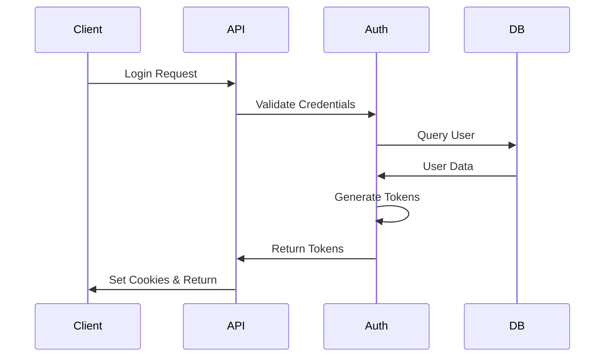

# Security Architecture

## Overview

The New Fuse implements a comprehensive security architecture that covers authentication, authorization, data protection, and secure communication.

## Authentication System

### JWT Implementation
```typescript
interface JWTPayload {
    sub: string;        // User ID
    username: string;   // Username
    role: string;      // User role
    iat: number;       // Issued at
    exp: number;       // Expiration
}
```

### Token Management
1. **Access Tokens**
   - Short-lived (15 minutes)
   - Stored in memory
   - Used for API authentication

2. **Refresh Tokens**
   - Long-lived (7 days)
   - HTTP-only cookie
   - Rotated on use

### Authentication Flow


## Authorization

### Role-Based Access Control
```typescript
enum UserRole {
    ADMIN = 'admin',
    MANAGER = 'manager',
    USER = 'user',
    GUEST = 'guest'
}

interface Permission {
    resource: string;
    action: 'create' | 'read' | 'update' | 'delete';
}
```

### Permission Matrix
| Role    | Tasks | Messages | Users | System |
|---------|-------|----------|--------|---------|
| Admin   | All   | All      | All    | All     |
| Manager | All   | All      | Read   | Read    |
| User    | Own   | Own      | None   | None    |
| Guest   | Read  | None     | None   | None    |

## Data Protection

### Encryption
- TLS 1.3 for transport
- AES-256 for sensitive data
- Argon2 for password hashing

### Input Validation
```typescript
// Example validation schema
const taskSchema = Joi.object({
    title: Joi.string().required().max(255),
    description: Joi.string().max(1000),
    priority: Joi.number().min(0).max(5),
    dueDate: Joi.date().greater('now')
});
```

### SQL Injection Prevention
- Parameterized queries
- TypeORM query builder
- Input sanitization

### XSS Protection
- Content Security Policy
- Output encoding
- Sanitize HTML content

## API Security

### Rate Limiting
```typescript
@UseGuards(ThrottlerGuard)
@Throttle(10, 60) // 10 requests per minute
export class AuthController {
    // ...
}
```

### CORS Configuration
```typescript
const corsOptions = {
    origin: process.env.ALLOWED_ORIGINS.split(','),
    credentials: true,
    methods: ['GET', 'POST', 'PUT', 'DELETE', 'OPTIONS'],
    allowedHeaders: ['Content-Type', 'Authorization']
};
```

### Request Validation
```typescript
app.useGlobalPipes(
    new ValidationPipe({
        whitelist: true,
        forbidNonWhitelisted: true,
        transform: true
    })
);
```

## WebSocket Security

### Connection Authentication
```typescript
@WebSocketGateway()
export class EventsGateway {
    @UseGuards(WsJwtGuard)
    handleConnection(client: Socket) {
        // Validate connection
    }
}
```

### Message Validation
```typescript
interface WebSocketMessage {
    type: string;
    payload: unknown;
    signature: string;
}
```

## Audit Logging

### Event Logging
```typescript
interface AuditLog {
    userId: string;
    action: string;
    resource: string;
    details: object;
    timestamp: Date;
    ip: string;
}
```

### Monitoring
- Failed login attempts
- Permission violations
- Resource access
- System changes

## Security Headers

```typescript
app.use(helmet({
    contentSecurityPolicy: {
        directives: {
            defaultSrc: ["'self'"],
            scriptSrc: ["'self'"],
            styleSrc: ["'self'", "'unsafe-inline'"],
            imgSrc: ["'self'", "data:", "https:"],
            connectSrc: ["'self'", "wss:"]
        }
    },
    referrerPolicy: { policy: 'same-origin' }
}));
```

## Secure Development

### Code Analysis
- ESLint security rules
- SonarQube scanning
- Dependency scanning
- Regular audits

### Security Testing
- Penetration testing
- Vulnerability scanning
- Security unit tests
- Integration tests

## Incident Response

For detailed incident response procedures, see:
- [Security Incident Response](/docs/operations/security-incident.md)
- [Recovery Procedures](/docs/operations/recovery.md)

## Further Reading

- [API Security](/docs/api/security.md)
- [Development Guidelines](/docs/guides/security.md)
- [Deployment Security](/docs/operations/deployment.md#security)
