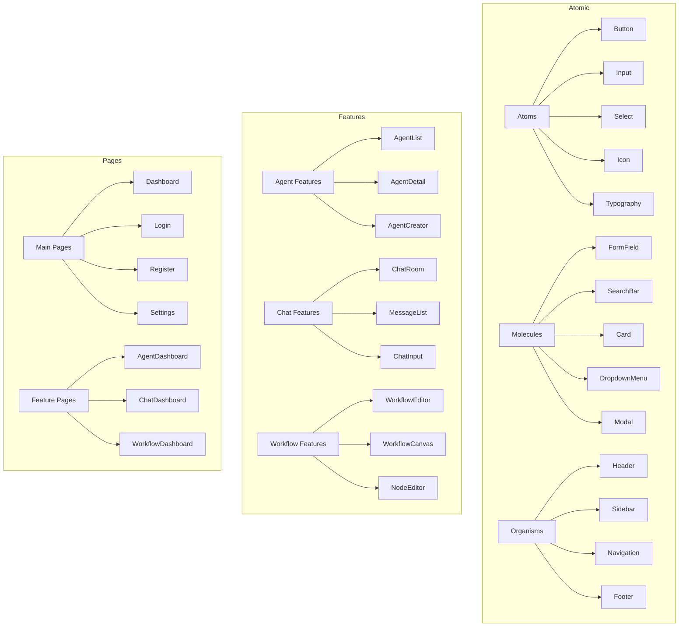

# UI Structure Map

## Core UI Components

## Component Locations

### Core Components
- `/packages/ui-components/src/atoms/`
- `/packages/ui-components/src/molecules/`
- `/packages/ui-components/src/organisms/`

### Feature Components
- `/apps/frontend/src/features/agents/`
- `/apps/frontend/src/features/chat/`
- `/apps/frontend/src/features/workflow/`

### Pages
- `/apps/frontend/src/pages/`