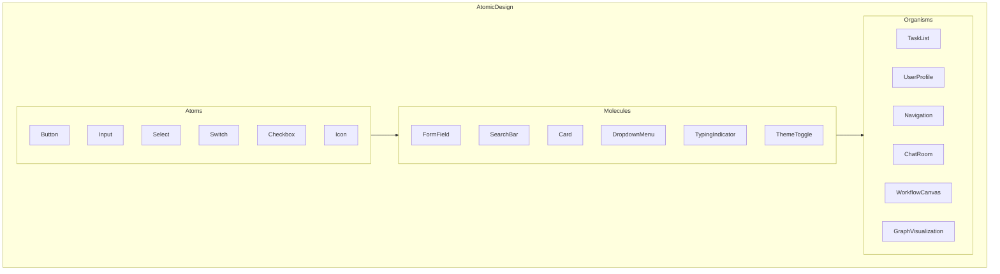
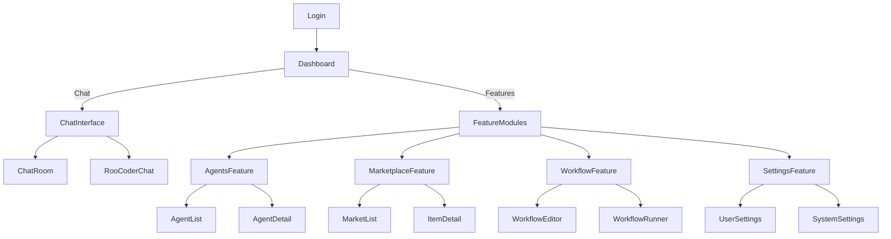
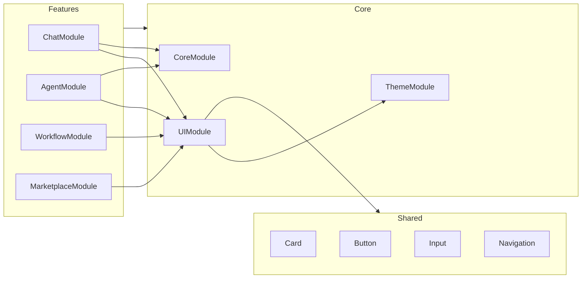

# UI Architecture Visualization

## 1. Component Hierarchy

```mermaid
graph TD
    subgraph AtomicDesign
        Atoms[Atomic Components]
        Molecules[Molecular Components]
        Organisms[Organism Components]
    end

    subgraph Atoms
        Button[Button]
        Input[Input]
        Select[Select]
        Switch[Switch]
        Checkbox[Checkbox]
        Icon[Icon]
    end

    subgraph Molecules
        FormField[FormField]
        SearchBar[SearchBar]
        Card[Card]
        DropdownMenu[DropdownMenu]
        TypingIndicator[TypingIndicator]
        ThemeToggle[ThemeToggle]
    end

    subgraph Organisms
        TaskList[TaskList]
        UserProfile[UserProfile]
        Navigation[Navigation]
        ChatRoom[ChatRoom]
        WorkflowCanvas[WorkflowCanvas]
        GraphVisualization[GraphVisualization]
    end

    Atoms --> Molecules
    Molecules --> Organisms
```

## 2. Navigation Flow

```mermaid
flowchart TB
    Login --> Dashboard
    Dashboard --> |Chat| ChatInterface
    ChatInterface --> ChatRoom
    ChatInterface --> RooCoderChat
    Dashboard --> |Features| FeatureModules
    FeatureModules --> AgentsFeature
    FeatureModules --> MarketplaceFeature
    FeatureModules --> WorkflowFeature
    FeatureModules --> SettingsFeature
    
    AgentsFeature --> AgentList
    AgentsFeature --> AgentDetail
    MarketplaceFeature --> MarketList
    MarketplaceFeature --> ItemDetail
    WorkflowFeature --> WorkflowEditor
    WorkflowFeature --> WorkflowRunner
    SettingsFeature --> UserSettings
    SettingsFeature --> SystemSettings
```

## 3. Component Dependencies

```mermaid
graph LR
    subgraph Core
        ThemeModule
        UIModule
        CoreModule
    end

    subgraph Features
        ChatModule
        AgentModule
        WorkflowModule
        MarketplaceModule
    end

    subgraph Shared
        Card
        Button
        Input
        Navigation
    end

    ChatModule --> UIModule
    ChatModule --> CoreModule
    AgentModule --> UIModule
    AgentModule --> CoreModule
    WorkflowModule --> UIModule
    MarketplaceModule --> UIModule

    UIModule --> ThemeModule
    UIModule --> Shared
    
    Features --> Core
```