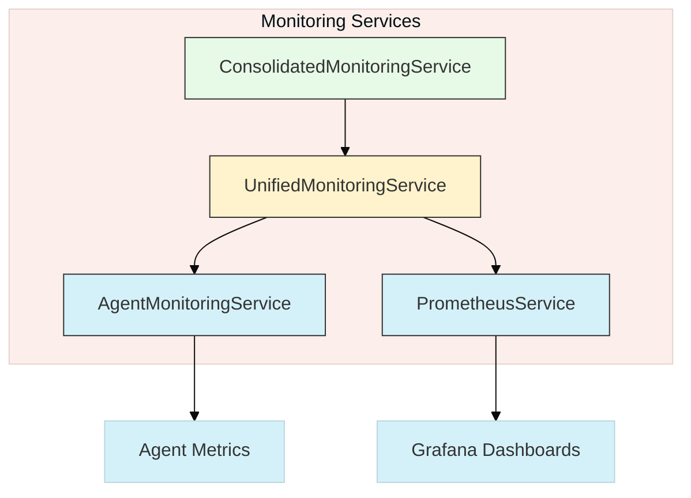
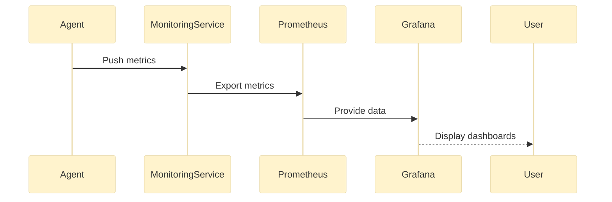
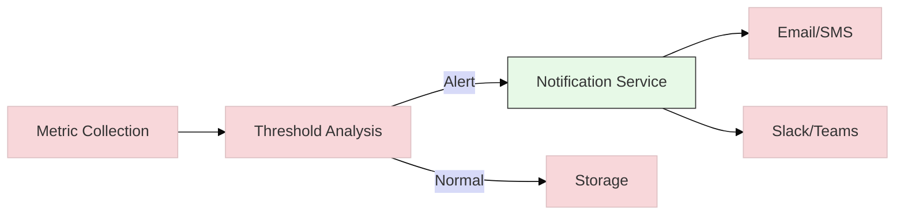

# Roo Monitoring Implementation Details

## Architecture Overview



The Roo monitoring system is implemented as part of the VSCode extension and consists of several components:

1. **RooOutputMonitor**: The core class responsible for monitoring and forwarding Roo's output
2. **WebSocket Server**: Handles communication with connected clients
3. **Output Channel Interception**: Captures output from Roo-related output channels
4. **Terminal Monitoring**: Detects and monitors terminals that might be running Roo

## Implementation Details

### RooOutputMonitor Class

The `RooOutputMonitor` class is the central component of the monitoring system. It:

- Monitors multiple output channels for Roo-related content
- Detects and monitors terminals that might be running Roo
- Processes output to categorize it based on content patterns
- Broadcasts messages to connected clients via WebSocket

### Output Channel Monitoring

The monitor intercepts output from VSCode output channels by replacing the original `append` and `appendLine` methods with custom implementations that:

1. Process the output to determine if it's Roo-related
2. Forward the output to connected clients
3. Call the original method to maintain normal functionality

```typescript
private monitorOutputChannel(channel: vscode.OutputChannel, isRooChannel: boolean) {
    // ... implementation details ...
    
    // Intercept and forward output
    const originalAppend = channel.append;
    channel.append = (value: string) => {
        this.processOutput(value, channelName, isRooChannel);
        originalAppend.call(channel, value);
    };
}
```

### Data Flow



### Output Processing

Output is processed to determine its type based on content patterns:

```typescript
private processOutput(value: string, source: string, isRooChannel: boolean) {
    // Check if this is direct Roo output
    const rooOutputPattern = /\[Roo Coder\]:|Roo>|Roo Coder:/i;
    const isDirectRooOutput = rooOutputPattern.test(value);
    
    // Check if this mentions Roo but isn't direct output
    const rooMentionPattern = /Roo|AI Coder|Code Assistant/i;
    const isRooRelated = !isDirectRooOutput && rooMentionPattern.test(value);
    
    // ... determine message type and broadcast ...
}
```

### Terminal Monitoring

The system monitors terminals to detect those that might be running Roo:

```typescript
private monitorTerminal(terminal: vscode.Terminal) {
    // ... implementation details ...
    
    // Check if this is a Roo-related terminal based on name
    const isRooTerminal = /Roo|AI Coder|Code Assistant/i.test(terminal.name);
    if (isRooTerminal) {
        this.broadcastMessage({
            type: 'roo_terminal_detected',
            content: `Detected Roo terminal: ${terminal.name}`,
            timestamp: new Date().toISOString()
        });
    }
}
```

## Message Format

Messages sent to clients follow this JSON format:

```json
{
  "type": "roo_output",
  "content": "The output content",
  "source": "Output channel name",
  "timestamp": "2023-07-01T12:34:56.789Z"
}
```

Message types include:

- `roo_output`: Direct output from Roo Coder
- `roo_related_output`: Output that mentions Roo but isn't direct output
- `output`: Other output from monitored channels
- `roo_terminal_detected`: Notification when a new Roo-related terminal is opened

## Integration with Extension

The monitoring system is initialized when the VSCode extension is activated:

```typescript
export function activate(context: vscode.ExtensionContext) {
    const connections: WebSocket[] = [];
    
    // Initialize Roo Output Monitor
    const rooMonitor = new RooOutputMonitor(connections);
    rooMonitor.startMonitoring();
    
    // Register for disposal
    context.subscriptions.push({
        dispose: () => rooMonitor.dispose()
    });
    
    // ... WebSocket server setup ...
}
```

## Limitations

- VSCode API doesn't provide direct access to terminal output unless the terminal is created with the ExtensionTerminal API
- Output channels created after the extension is activated might not be detected automatically
- Pattern matching for Roo-related content might produce false positives or miss some outputs

## Alerting Pipeline



## Future Improvements

- Add configuration options for customizing monitoring behavior
- Implement more sophisticated pattern matching for better detection
- Add support for filtering and searching monitored output
- Provide a UI for viewing and analyzing monitored output
