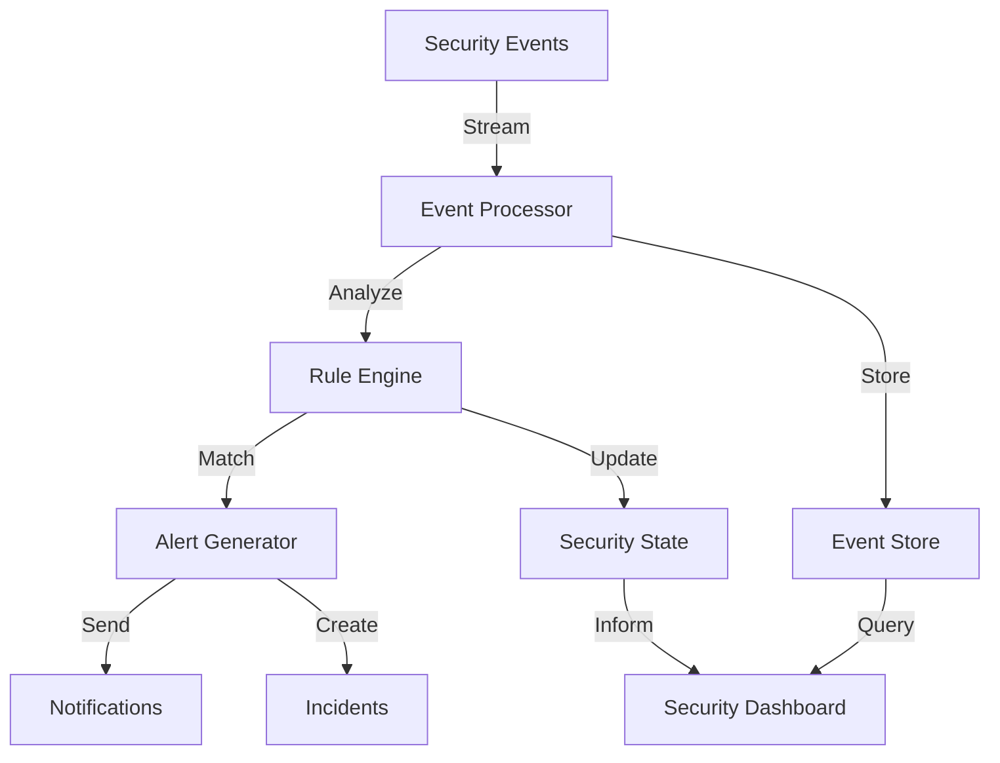
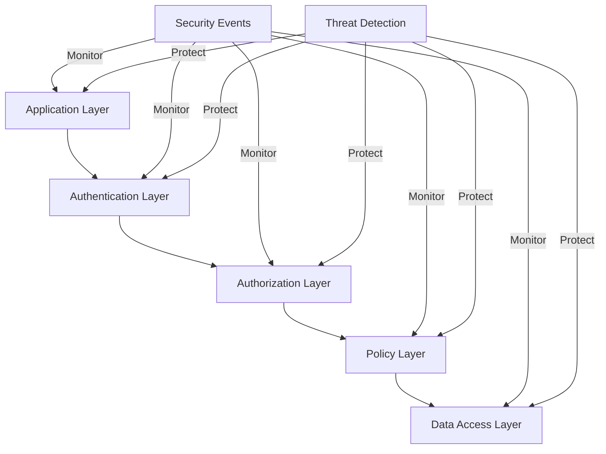
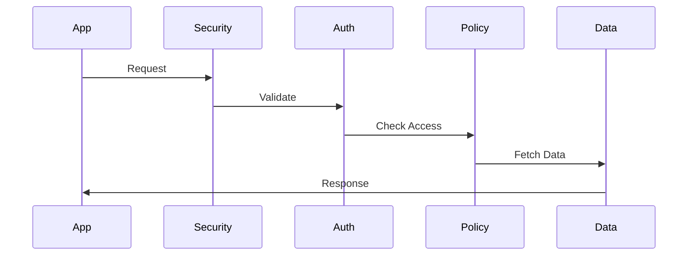

# Security Documentation

## Overview

The New Fuse implements a comprehensive security architecture that covers authentication, authorization, data protection, and secure communication. This document consolidates security information from across the project to provide a complete reference.

## Core Security Features

### Authentication

#### User Authentication Flow
1. **Registration**
   - Email verification required
   - Strong password requirements enforced
   - Optional two-factor authentication setup

2. **Login**
   - Email/password authentication
   - Two-factor authentication (if enabled)
   - Session management with secure tokens
   - Rate limiting to prevent brute force attacks

3. **Password Requirements**
   - Minimum 8 characters
   - At least one uppercase letter
   - At least one lowercase letter
   - At least one number
   - At least one special character

#### JWT Implementation
```typescript
interface JWTPayload {
    sub: string;        // User ID
    username: string;   // Username
    role: string;      // User role
    iat: number;       // Issued at
    exp: number;       // Expiration
}
```

#### Token Management
1. **Access Tokens**
   - Short-lived (15 minutes)
   - Stored in memory
   - Used for API authentication

2. **Refresh Tokens**
   - Long-lived (7 days)
   - HTTP-only cookie
   - Rotated on use

#### Multi-Factor Authentication (MFA)
- TOTP-based authentication
- QR code setup
- Backup codes generation
- Device management
- WebAuthn support for hardware keys

**Implementation Components:**
- [Email Verification](../../src/components/auth/EmailVerification.tsx)
- [Two Factor Authentication](../../src/components/auth/TwoFactorAuth.tsx)
- [Security Compliance Workflow](../../apps/web/src/components/workflow/examples/SecurityComplianceWorkflow.tsx)

#### Single Sign-On (SSO)
```typescript
// Configure SSO providers
await securityService.configureSSO({
  providers: [
    {
      type: 'okta',
      config: {
        issuer: process.env.OKTA_ISSUER,
        clientId: process.env.OKTA_CLIENT_ID,
        clientSecret: process.env.OKTA_CLIENT_SECRET,
        scopes: ['openid', 'profile', 'email'],
      },
    },
    {
      type: 'azure-ad',
      config: {
        tenantId: process.env.AZURE_TENANT_ID,
        clientId: process.env.AZURE_CLIENT_ID,
        clientSecret: process.env.AZURE_CLIENT_SECRET,
      },
    },
  ],
});
```

### Session Management
- JWT-based authentication
- Configurable session timeout
- Secure token storage
- Automatic token refresh
- Session invalidation on security events
- Active session tracking and management

## Authorization

### Role-Based Access Control (RBAC)
```typescript
enum UserRole {
    ADMIN = 'admin',
    MANAGER = 'manager',
    USER = 'user',
    GUEST = 'guest'
}

interface Permission {
    resource: string;
    action: 'create' | 'read' | 'update' | 'delete';
}
```

#### Permission Matrix
| Role    | Tasks | Messages | Users | System |
|---------|-------|----------|--------|--------|
| Admin   | All   | All      | All    | All     |
| Manager | All   | All      | Read   | Read    |
| User    | Own   | Own      | None   | None    |
| Guest   | Read  | None     | None   | None    |

### Policy Management
- Custom security policies
- Policy evaluation engine
- Rule-based access control
- Policy inheritance and override

### Policy-Based Authorization
```typescript
// Define policy
const adminPolicy = {
  name: 'Admin Policy',
  rules: [
    {
      resource: 'user_management',
      action: 'manage',
      effect: 'allow',
      conditions: {
        roles: ['admin'],
        timeOfDay: {
          start: '09:00',
          end: '17:00',
        },
        ipRange: ['10.0.0.0/24'],
      },
    },
  ],
};
```

### Attribute-Based Access Control (ABAC)
```typescript
const abacPolicy = {
  rules: [
    {
      effect: 'allow',
      attributes: {
        user: {
          department: '${resource.department}',
          clearance: { gte: '${resource.classification}' },
        },
        resource: {
          type: 'document',
          status: 'published',
        },
        environment: {
          time: { between: ['09:00', '17:00'] },
          location: { in: ['office', 'vpn'] },
        },
      },
    },
  ],
};
```

## Data Protection

### Encryption
- TLS 1.3 for transport
- AES-256 for sensitive data
- Argon2 for password hashing

### Input Validation
```typescript
// Example validation schema
const taskSchema = Joi.object({
    title: Joi.string().required().max(255),
    description: Joi.string().max(1000),
    priority: Joi.number().min(0).max(5),
    dueDate: Joi.date().greater('now')
});
```

### SQL Injection Prevention
- Parameterized queries
- TypeORM query builder
- Input sanitization

### XSS Protection
- Content Security Policy
- Output encoding
- Sanitize HTML content

## API Security

### Rate Limiting
```typescript
@UseGuards(ThrottlerGuard)
@Throttle(10, 60) // 10 requests per minute
export class AuthController {
    // ...
}
```

#### AI Operation Limits
- Neural memory operations: 100/minute
- Vector similarity searches: 50/minute
- Pattern recognition: 30/minute
- Concurrent agent tasks: 5/user
- Memory storage: 1GB/user
- Monitoring and alerting for limit breaches

### CORS Configuration
```typescript
const corsOptions = {
    origin: process.env.ALLOWED_ORIGINS.split(','),
    credentials: true,
    methods: ['GET', 'POST', 'PUT', 'DELETE', 'OPTIONS'],
    allowedHeaders: ['Content-Type', 'Authorization']
};
```

### Request Validation
```typescript
app.useGlobalPipes(
    new ValidationPipe({
        whitelist: true,
        forbidNonWhitelisted: true,
        transform: true
    })
);
```

### Security Headers
```typescript
app.use(helmet({
    contentSecurityPolicy: {
        directives: {
            defaultSrc: ["'self'"],
            scriptSrc: ["'self'"],
            styleSrc: ["'self'", "'unsafe-inline'"],
            imgSrc: ["'self'", "data:", "https:"],
            connectSrc: ["'self'", "wss:"]
        }
    },
    referrerPolicy: { policy: 'same-origin' }
}));
```

### IP Whitelist
- IP-based access control
- Configurable trusted IPs
- Automatic blocking of suspicious IPs
- Geolocation-based restrictions

## WebSocket Security

### Connection Authentication
```typescript
@WebSocketGateway()
export class EventsGateway {
    @UseGuards(WsJwtGuard)
    handleConnection(client: Socket) {
        // Validate connection
    }
}
```

### Message Validation
```typescript
interface WebSocketMessage {
    type: string;
    payload: unknown;
    signature: string;
}
```

## Audit Logging

### Security Events
```typescript
export enum SecurityEventType {
  LOGIN_SUCCESS = "LOGIN_SUCCESS",
  LOGIN_FAILURE = "LOGIN_FAILURE",
  LOGOUT = "LOGOUT",
  PASSWORD_CHANGE = "PASSWORD_CHANGE",
  PASSWORD_RESET_REQUEST = "PASSWORD_RESET_REQUEST",
  PASSWORD_RESET_COMPLETE = "PASSWORD_RESET_COMPLETE",
  MFA_SETUP = "MFA_SETUP",
  MFA_VERIFICATION = "MFA_VERIFICATION",
  MFA_DISABLED = "MFA_DISABLED",
  ACCOUNT_LOCKOUT = "ACCOUNT_LOCKOUT",
  SUSPICIOUS_ACTIVITY = "SUSPICIOUS_ACTIVITY",
  SESSION_EXPIRED = "SESSION_EXPIRED",
  DEVICE_ADDED = "DEVICE_ADDED",
  DEVICE_REMOVED = "DEVICE_REMOVED",
  SETTINGS_CHANGED = "SETTINGS_CHANGED"
}
```

### Event Logging
```typescript
interface AuditLog {
    userId: string;
    action: string;
    resource: string;
    details: object;
    timestamp: Date;
    ip: string;
}
```

### Monitoring
- Failed login attempts
- Permission violations
- Resource access
- System changes

### Audit Trail
- Detailed event logging
- User activity tracking
- IP address logging
- Timestamp recording
- Event correlation

## Threat Detection and Response

### Real-time Security Monitoring


### Suspicious Login Detection
```typescript
// Configure login security
const loginSecurity = {
  async handleLoginAttempt(credentials, context) {
    // Track attempts
    const attempts = await securityService.tracking.getLoginAttempts({
      username: credentials.username,
      ip: context.ip,
      timeWindow: '15m',
    });

    // Calculate risk score
    const riskScore = await securityService.risk.calculateLoginRisk({
      attempts,
      context,
      userHistory: await securityService.getUserLoginHistory(credentials.username),
    });

    // Handle based on risk
    if (riskScore > 80) {
      // High risk
      await Promise.all([
        securityService.security.blockIP(context.ip),
        securityService.notifications.alertSecurityTeam({
          type: 'suspicious_login',
          details: { credentials, context, riskScore },
        }),
      ]);
      throw new SecurityError('Suspicious login blocked');
    } else if (riskScore > 50) {
      // Medium risk
      return {
        requireAdditionalMFA: true,
        allowedMethods: ['webauthn', 'totp'],
      };
    }

    // Low risk - proceed with normal login
    return { requireAdditionalMFA: false };
  },
};
```

## Compliance and Reporting

### Compliance Audit Trail
```typescript
// Configure compliance logging
await securityService.configureCompliance({
  standards: ['SOC2', 'GDPR', 'HIPAA'],
  retention: {
    default: '7-years',
    sensitive: '10-years',
  },
  encryption: {
    algorithm: 'AES-256-GCM',
    keyRotation: '90-days',
  },
});
```

### Security Reports
- Security incident reports
- Compliance reports
- Access audit reports
- User activity reports

## Security Best Practices

### Password Security
1. Never store plain-text passwords
2. Use strong hashing algorithms (Argon2)
3. Implement password rotation policies
4. Enforce password complexity requirements

### API Security
1. Use HTTPS for all endpoints
2. Implement proper authentication
3. Validate all inputs
4. Rate limit API endpoints
5. Use secure session management

### Data Protection
1. Encrypt sensitive data at rest
2. Use secure communication channels
3. Implement proper access controls
4. Regular security audits
5. Data backup and recovery

## Security Architecture

### Layered Security Model



### Component Interaction



## Configuration

### Environment Variables
```env
# Authentication
AUTH_SECRET=your-secret-key
AUTH_TOKEN_EXPIRY=3600
AUTH_REFRESH_TOKEN_EXPIRY=604800

# Rate Limiting
RATE_LIMIT_WINDOW=900
RATE_LIMIT_MAX_REQUESTS=100

# Security Headers
SECURITY_HSTS_MAX_AGE=31536000
SECURITY_FRAME_OPTIONS=DENY

# Two-Factor Authentication
MFA_ISSUER=NewFuse
MFA_DIGITS=6
MFA_WINDOW=1

# Audit Logging
AUDIT_ENABLED=true
AUDIT_RETENTION_DAYS=90
```

### Security Settings
```typescript
interface SecuritySettings {
  mfaEnabled: boolean;
  sessionTimeout: number;
  notificationsEnabled: boolean;
  ipWhitelistEnabled: boolean;
}
```

## Error Handling

### Security Events
- Failed authentication attempts
- Invalid tokens
- Policy violations
- Rate limit exceeded
- Suspicious activity detection

### Response Codes
- 401: Unauthorized
- 403: Forbidden
- 429: Too Many Requests
- 400: Bad Request
- 500: Internal Server Error

## Monitoring and Alerts

### Security Monitoring
- Real-time security event monitoring
- Automated threat detection
- Performance monitoring
- System health checks
- Comprehensive monitoring of system components
- Error tracking and analysis

### Security Logging
- Authentication attempts (success/failure)
- Authorization violations
- Resource access patterns
- System configuration changes
- Alerts for security events

### Alert Configuration
- Email notifications
- Webhook integration
- Alert severity levels
- Alert aggregation
- Custom alert rules

## Development Guidelines

### Secure Coding Practices
1. Input validation
2. Output encoding
3. Proper error handling
4. Secure dependency management
5. Regular security updates

### Testing Requirements
1. Security unit tests
2. Integration tests
3. Penetration testing
4. Vulnerability scanning
5. Compliance testing

## Incident Response

### Security Incidents
1. Unauthorized access attempts
2. Data breaches
3. Malware detection
4. Denial of service attacks
5. Insider threats

### Response Procedures
1. Incident identification
2. Containment measures
3. Eradication steps
4. Recovery procedures
5. Post-incident analysis

## API Reference

For detailed API reference, please see the [Security API Reference](./security/API_REFERENCE.md) document.

## Use Cases and Examples

For specific use cases and implementation examples, please refer to:
- [Security Use Cases](./security/USE_CASES.md)
- [Security Examples](./security/EXAMPLES.md)
- [Specific Security Scenarios](./security/SPECIFIC_SCENARIOS.md)

## Advanced Topics

For advanced security topics and implementations, please see the [Advanced Security Topics](./security/ADVANCED_TOPICS.md) document.

## Compliance

### Standards
- GDPR compliance
- HIPAA compliance
- SOC 2 compliance
- PCI DSS compliance

### Regular Audits
1. Security assessments
2. Compliance reviews
3. Policy updates
4. Training requirements
5. Documentation maintenance
