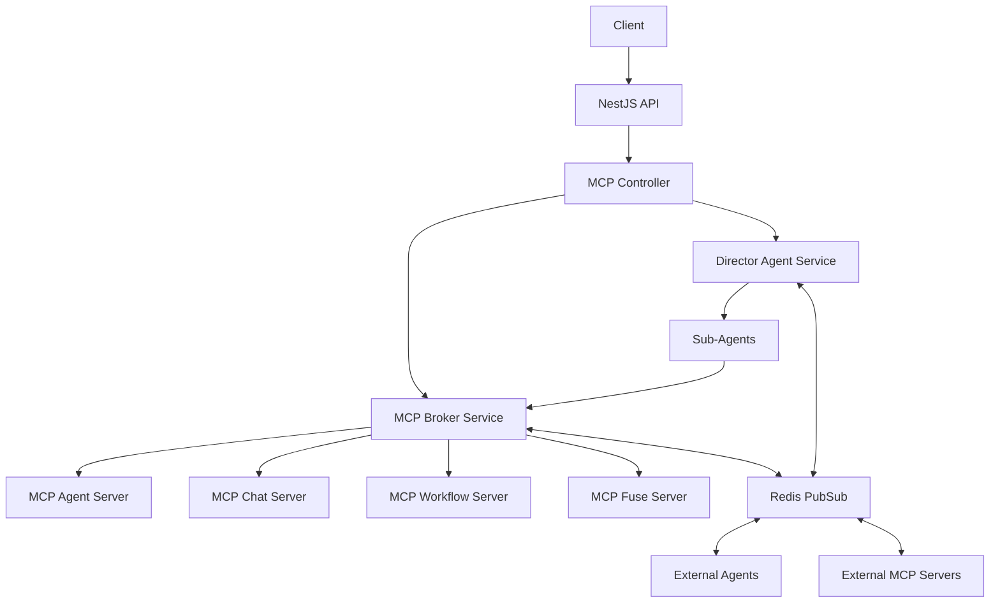
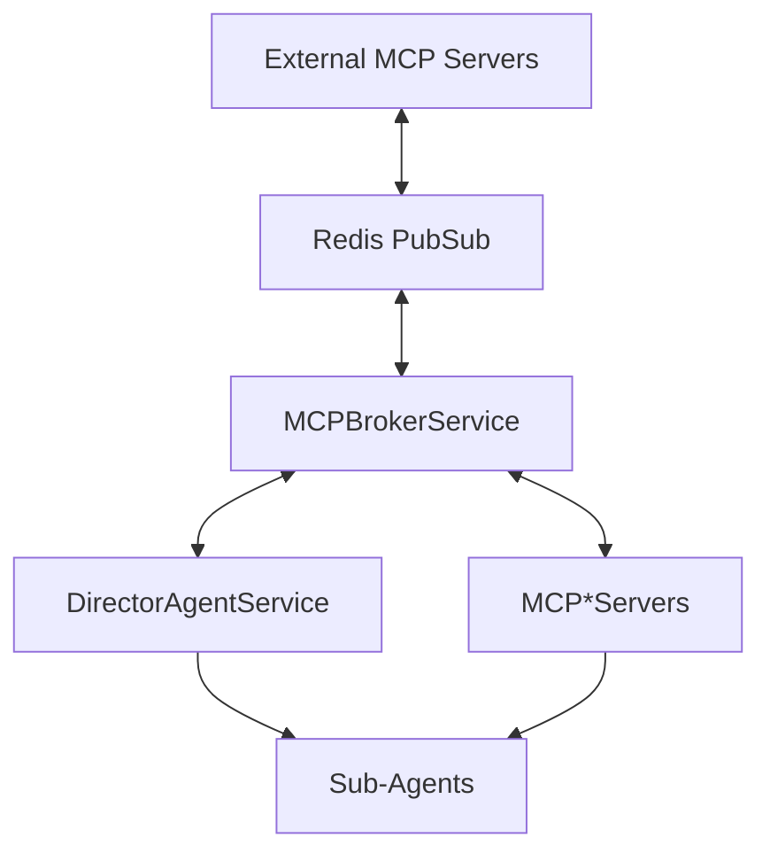

# MCP Integration with NestJS

This document explains how the Model Context Protocol (MCP) is integrated with NestJS in The New Fuse.

## Architecture Overview

The MCP integration with NestJS follows a broker/director pattern, with The New Fuse serving as the primary MCP server while also being able to act as an MCP client to other MCP servers.



### The New Fuse as Primary MCP Server

The New Fuse platform serves as the primary MCP server in this architecture. This means:

1. It provides a centralized hub (MCPBrokerService) for all MCP communication
2. It hosts multiple specialized MCP servers (Agent, Chat, Workflow, Fuse)
3. It exposes MCP capabilities through a unified API
4. It manages the coordination of tasks and agents through the Director Agent

### Agents as MCP Clients

All agents within The New Fuse can act as MCP clients. This includes:

1. The Director Agent, which is the primary coordinator
2. Sub-agents that specialize in specific tasks
3. External agents that connect through Redis

Agents can consume MCP capabilities from any MCP server, whether internal to The New Fuse or external.

## Components

### MCP Broker Service

The `MCPBrokerService` is the central entry point for all MCP directives. It:

1. Provides a unified interface for executing MCP directives
2. Routes messages to the appropriate MCP server
3. Handles communication via Redis for distributed setups
4. Manages message passing between MCP servers and agents

### Director Agent Service

The `DirectorAgentService` is the main agent that coordinates all MCP operations. It:

1. Manages tasks and their lifecycle
2. Assigns tasks to appropriate agents
3. Monitors task execution
4. Provides a high-level interface for task management

### MCP Servers

The MCP servers provide the actual implementation of MCP capabilities and tools:

1. `MCPAgentServer`: Agent-related capabilities
2. `MCPChatServer`: Chat-related capabilities
3. `MCPWorkflowServer`: Workflow-related capabilities
4. `MCPFuseServer`: Fuse-specific capabilities

### MCP Controller

The `MCPController` exposes the MCP functionality via a REST API. It provides:

1. Endpoints for executing MCP directives
2. Endpoints for managing tasks
3. Legacy endpoints for direct server access

## Communication Flow

1. Client sends a request to the MCP Controller
2. MCP Controller forwards the request to the MCP Broker
3. MCP Broker creates a message and publishes it to Redis
4. MCP Broker also executes the directive locally
5. Director Agent monitors tasks and assigns them to agents
6. Agents execute tasks and report results back through Redis
7. Results are returned to the client

## Redis Channels

The following Redis channels are used for communication:

- `mcp:broadcast`: Broadcast messages to all MCP instances
- `mcp:direct:{instanceId}`: Direct messages to a specific instance
- `mcp:server:{serverName}`: Messages for a specific MCP server

## Usage Examples

### Execute MCP Directive

```typescript
// Using the MCP Broker Service
const result = await mcpBroker.executeDirective(
  'agent',           // Server name
  'registerAgent',   // Action
  {                  // Parameters
    name: 'my-agent',
    capabilities: ['code', 'search']
  },
  {                  // Options
    sender: 'api',
    metadata: {
      priority: 'high'
    }
  }
);
```

### Create a Task

```typescript
// Using the Director Agent Service
const task = await directorAgent.createTask(
  'agent.registerAgent',
  'Register a new agent',
  {
    name: 'my-agent',
    capabilities: ['code', 'search']
  },
  {
    priority: 'high',
    metadata: {
      requestedBy: 'user123'
    }
  }
);
```

### REST API

```bash
# Execute MCP directive
POST /mcp/execute
{
  "serverName": "agent",
  "action": "registerAgent",
  "params": {
    "name": "my-agent",
    "capabilities": ["code", "search"]
  },
  "sender": "api",
  "metadata": {
    "priority": "high"
  }
}

# Create a task
POST /mcp/tasks
{
  "type": "agent.registerAgent",
  "description": "Register a new agent",
  "params": {
    "name": "my-agent",
    "capabilities": ["code", "search"]
  },
  "priority": "high",
  "metadata": {
    "requestedBy": "user123"
  }
}

# Get all tasks
GET /mcp/tasks?status=pending&assignedTo=agent1

# Get a specific task
GET /mcp/tasks/task_123456
```

## Adding New MCP Servers

To add a new MCP server:

1. Create a new class that extends `MCPServer`
2. Register it in the `MCPModule`
3. Add it to the `MCPBrokerService` constructor

Example:

```typescript
// 1. Create the server
@Injectable()
export class MCPNewServer extends MCPServer {
  constructor() {
    super({
      capabilities: {
        // Define capabilities
      },
      tools: {
        // Define tools
      }
    });
  }
}

// 2. Register in MCPModule
@Module({
  providers: [
    // ...
    MCPNewServer
  ],
  exports: [
    // ...
    MCPNewServer
  ]
})
export class MCPModule {}

// 3. Add to MCPBrokerService
constructor(
  // ...
  private readonly newServer: MCPNewServer
) {
  // ...
  this.servers.set('new', this.newServer);
}
```

## MCP Client-Server Relationships

### Primary MCP Agent as Client to Other MCP Servers

The primary MCP agent (Director Agent) in The New Fuse can act as an MCP client to other MCP servers:

1. It can issue directives to any internal MCP server through the broker
2. It can communicate with external MCP servers through Redis
3. It can delegate tasks to sub-agents that may use different MCP servers

This dual role (both server and client) allows The New Fuse to:

- Provide MCP capabilities to external systems
- Consume MCP capabilities from external systems
- Orchestrate complex workflows that span multiple MCP servers

### Inheritance of Relationships by Sub-Agents

All sub-agent classifications within The New Fuse inherit the MCP client-server relationships:

1. Any sub-agent can access any MCP server through the broker
2. The hierarchical structure allows capabilities to be inherited down the agent tree
3. Sub-agents benefit from the authentication and routing provided by the parent agents

This inheritance model creates a powerful ecosystem where:

- New agents can be added without modifying the MCP infrastructure
- Specialized agents can focus on their core capabilities while leveraging shared MCP access
- The platform can evolve by adding new MCP servers that are immediately available to all agents

## Hub and Spoke Model with Inheritance

The architecture follows a "hub and spoke" model with inheritance capabilities:



In this model:

1. **MCPBrokerService** is the central hub that manages all MCP communication
2. **DirectorAgentService** is the primary agent that coordinates tasks
3. **MCP*Servers** (AgentServer, ChatServer, etc.) provide specific capabilities
4. **Sub-Agents** inherit the ability to communicate with any MCP server through the broker

The Redis PubSub layer allows external MCP servers to participate in this ecosystem, and The New Fuse can act as both an MCP server (providing capabilities to external clients) and an MCP client (consuming capabilities from external servers).

## Practical Example: Cross-Server Communication

Here's a practical example of how this architecture enables cross-server communication:

1. A sub-agent (e.g., a code analysis agent) needs to perform a file operation
2. The sub-agent sends a request to the Director
3. The Director creates a task and sends it to the MCPBroker
4. The MCPBroker determines that this task requires the filesystem MCP server
5. The MCPBroker sends the request to the filesystem server (which could be internal or external)
6. The filesystem server performs the operation and sends the result back through Redis
7. The MCPBroker receives the result and forwards it to the Director
8. The Director updates the task status and notifies the sub-agent

This flow works the same way regardless of whether the MCP server is internal to The New Fuse or an external server, and it works for any type of agent within the platform.

## Conclusion

This integration provides a robust and scalable architecture for MCP in The New Fuse. The broker/director pattern ensures a single point of entry for all MCP directives while allowing for distributed execution and coordination of tasks.

The New Fuse serves as the primary MCP server in this architecture, but it can also act as an MCP client to other MCP servers. This dual role, combined with the inheritance of relationships by sub-agents, creates a powerful ecosystem for AI agent coordination and communication.
