# The New Fuse Platform Visual Sitemap

```mermaid
graph TD
    Root[The New Fuse] --> Auth[Authentication]
    Root --> Dashboard[Dashboard]
    Root --> Agents[Agents]
    Root --> Tasks[Tasks]
    Root --> Workflows[Workflows]
    Root --> Suggestions[Suggestions]
    Root --> Integration[Integration & API]
    Root --> Admin[Administration]
    Root --> UserSettings[User Settings]
    Root --> Help[Help & Support]
    
    %% Authentication
    Auth --> Login[Login]
    Auth --> Register[Register]
    Auth --> ForgotPassword[Forgot Password]
    Auth --> ResetPassword[Reset Password]
    Auth --> VerifyEmail[Verify Email]
    
    %% Dashboard
    Dashboard --> MainDashboard[Main Dashboard]
    Dashboard --> AnalyticsDashboard[Analytics Dashboard]
    Dashboard --> ActivityLog[Activity Log]
    Dashboard --> NotificationsCenter[Notifications Center]
    
    %% Agents
    Agents --> AgentsList[Agents List]
    Agents --> AgentDetails[Agent Details]
    Agents --> CreateAgent[Create Agent]
    Agents --> EditAgent[Edit Agent]
    Agents --> AgentLogs[Agent Logs]
    Agents --> AgentMonitoring[Agent Monitoring]
    Agents --> AgentMarketplace[Agent Marketplace]
    
    %% Tasks
    Tasks --> TasksList[Tasks List]
    Tasks --> TaskDetails[Task Details]
    Tasks --> CreateTask[Create Task]
    Tasks --> EditTask[Edit Task]
    Tasks --> TaskBoard[Task Board]
    Tasks --> TaskCalendar[Task Calendar]
    Tasks --> TaskReports[Task Reports]
    
    %% Workflows
    Workflows --> WorkflowsList[Workflows List]
    Workflows --> WorkflowDetails[Workflow Details]
    Workflows --> CreateWorkflow[Create Workflow]
    Workflows --> EditWorkflow[Edit Workflow]
    Workflows --> WorkflowExecution[Workflow Execution]
    Workflows --> WorkflowTemplates[Workflow Templates]
    
    %% Suggestions
    Suggestions --> SuggestionsList[Suggestions List]
    Suggestions --> SuggestionDetails[Suggestion Details]
    Suggestions --> CreateSuggestion[Create Suggestion]
    Suggestions --> EditSuggestion[Edit Suggestion]
    
    %% Integration & API
    Integration --> APIKeys[API Keys]
    Integration --> Webhooks[Webhooks]
    Integration --> ThirdParty[Third-Party Integrations]
    Integration --> APIDocs[API Documentation]
    Integration --> APIExplorer[API Explorer]
    
    %% Administration
    Admin --> UserManagement[User Management]
    Admin --> TeamManagement[Team Management]
    Admin --> SystemSettings[System Settings]
    Admin --> AuditLogs[Audit Logs]
    Admin --> UsageStats[Usage Statistics]
    Admin --> Billing[Billing & Subscription]
    
    %% User Settings
    UserSettings --> Profile[User Profile]
    UserSettings --> Account[Account Settings]
    UserSettings --> NotificationPrefs[Notification Preferences]
    UserSettings --> APIAccess[Personal API Access]
    UserSettings --> TeamMembership[Team Membership]
    
    %% Help & Support
    Help --> Documentation[Documentation]
    Help --> Tutorials[Tutorials]
    Help --> FAQ[FAQ]
    Help --> Support[Support Tickets]
    Help --> Community[Community Forum]
```

## URL Structure

### Authentication
- `/login` - Login page
- `/register` - Registration page
- `/forgot-password` - Forgot password page
- `/reset-password` - Reset password page
- `/verify-email` - Email verification page

### Dashboard
- `/dashboard` - Main dashboard
- `/analytics` - Analytics dashboard
- `/activity` - Activity log
- `/notifications` - Notifications center

### Agents
- `/agents` - Agents list
- `/agents/:id` - Agent details
- `/agents/new` - Create new agent
- `/agents/:id/edit` - Edit agent
- `/agents/:id/logs` - Agent logs
- `/agents/:id/monitoring` - Agent monitoring
- `/agents/marketplace` - Agent marketplace

### Tasks
- `/tasks` - Tasks list
- `/tasks/:id` - Task details
- `/tasks/new` - Create new task
- `/tasks/:id/edit` - Edit task
- `/tasks/board` - Kanban board
- `/tasks/calendar` - Calendar view
- `/tasks/reports` - Task reports

### Workflows
- `/workflows` - Workflows list
- `/workflows/:id` - Workflow details
- `/workflows/new` - Create new workflow
- `/workflows/:id/edit` - Edit workflow
- `/workflows/:id/execution` - Workflow execution
- `/workflows/templates` - Workflow templates

### Suggestions
- `/suggestions` - Suggestions list
- `/suggestions/:id` - Suggestion details
- `/suggestions/new` - Create new suggestion
- `/suggestions/:id/edit` - Edit suggestion

### Integration & API
- `/integration/api-keys` - API keys management
- `/integration/webhooks` - Webhooks configuration
- `/integration/third-party` - Third-party integrations
- `/integration/api-docs` - API documentation
- `/integration/api-explorer` - API explorer

### Administration
- `/admin/users` - User management
- `/admin/teams` - Team management
- `/admin/settings` - System settings
- `/admin/audit-logs` - Audit logs
- `/admin/usage` - Usage statistics
- `/admin/billing` - Billing & subscription

### User Settings
- `/settings/profile` - User profile
- `/settings/account` - Account settings
- `/settings/notifications` - Notification preferences
- `/settings/api-access` - Personal API access
- `/settings/teams` - Team membership

### Help & Support
- `/help/documentation` - Documentation
- `/help/tutorials` - Tutorials
- `/help/faq` - FAQ
- `/help/support` - Support tickets
- `/help/community` - Community forum
