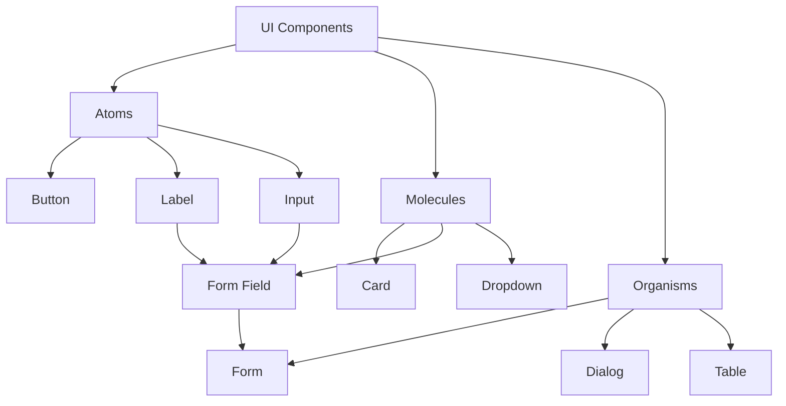

# The New Fuse UI Component System

A comprehensive, accessible, and customizable UI component library built with React, TypeScript, and Tailwind CSS.

## Table of Contents

- [Installation](#installation)
- [Usage](#usage)
- [Theme Customization](#theme-customization)
- [Accessibility](#accessibility)
- [Component Reference](#component-reference)
  - [Button](#button)
  - [Card](#card)
  - [Label](#label)

## Installation

```bash
npm install @the-new-fuse/ui-components
```

## Usage

Import components from the consolidated package:

```tsx
import { Button, Card, Label } from '@the-new-fuse/ui-components/consolidated';
```

## Theme Customization

The component library uses Tailwind CSS for styling. You can customize the theme by extending your `tailwind.config.js`:

```js
module.exports = {
  theme: {
    extend: {
      colors: {
        'card': 'var(--card)',
        'card-foreground': 'var(--card-foreground)',
        'destructive': 'var(--destructive)',
        'muted-foreground': 'var(--muted-foreground)',
      }
    }
  }
}
```

## Accessibility

All components are built with accessibility in mind:
- ARIA attributes are properly implemented
- Keyboard navigation support
- Screen reader friendly
- Color contrast compliance
- Focus management
- Semantic HTML

## Component Reference

### Button

A versatile button component that supports multiple variants, sizes, and states.

#### Props

\`\`\`typescript
interface ButtonProps extends ButtonHTMLAttributes<HTMLButtonElement> {
  variant?: 'default' | 'destructive' | 'outline' | 'secondary' | 'ghost' | 'link';
  size?: 'default' | 'sm' | 'lg' | 'icon';
  isLoading?: boolean;
  icon?: ReactNode;
  iconPosition?: 'start' | 'end';
  asChild?: boolean;
}
\`\`\`

#### Examples

```tsx
// Basic usage
<Button>Click me</Button>

// With variants
<Button variant="destructive">Delete</Button>
<Button variant="outline">Cancel</Button>

// With sizes
<Button size="sm">Small</Button>
<Button size="lg">Large</Button>

// With loading state
<Button isLoading>Processing...</Button>

// With icon
<Button icon={<IconComponent />}>With Icon</Button>
```

### Card

A flexible card component for grouping related content.

#### Props

\`\`\`typescript
interface CardProps extends HTMLAttributes<HTMLDivElement> {
  variant?: 'default' | 'destructive' | 'ghost';
  size?: 'default' | 'sm' | 'lg';
  hover?: boolean;
  clickable?: boolean;
}

// Subcomponents
interface CardHeaderProps extends HTMLAttributes<HTMLDivElement> {}
interface CardTitleProps extends HTMLAttributes<HTMLHeadingElement> {}
interface CardDescriptionProps extends HTMLAttributes<HTMLParagraphElement> {}
interface CardContentProps extends HTMLAttributes<HTMLDivElement> {}
interface CardFooterProps extends HTMLAttributes<HTMLDivElement> {}
\`\`\`

#### Examples

```tsx
// Basic usage
<Card>
  <CardHeader>
    <CardTitle>Card Title</CardTitle>
    <CardDescription>Card Description</CardDescription>
  </CardHeader>
  <CardContent>
    Main content goes here
  </CardContent>
  <CardFooter>
    <Button>Action</Button>
  </CardFooter>
</Card>

// Interactive card
<Card hover clickable>
  Interactive card content
</Card>

// With variants
<Card variant="ghost">Ghost card</Card>
```

### Label

An accessible form label component with support for required fields and error states.

#### Props

\`\`\`typescript
interface LabelProps extends LabelHTMLAttributes<HTMLLabelElement> {
  required?: boolean;
  error?: boolean;
}
\`\`\`

#### Examples

```tsx
// Basic usage
<Label htmlFor="email">Email</Label>

// Required field
<Label htmlFor="password" required>Password</Label>

// Error state
<Label htmlFor="username" error>Username</Label>
```

## Component Hierarchy



## Best Practices

1. Component Usage
   - Always use TypeScript for type safety
   - Include proper prop documentation
   - Follow the component hierarchy
   - Use semantic HTML elements

2. Accessibility
   - Use proper ARIA attributes
   - Ensure keyboard navigation
   - Maintain proper focus management
   - Test with screen readers

3. Styling
   - Use provided variants instead of custom styles
   - Follow the design token system
   - Use responsive design patterns
   - Maintain dark mode support