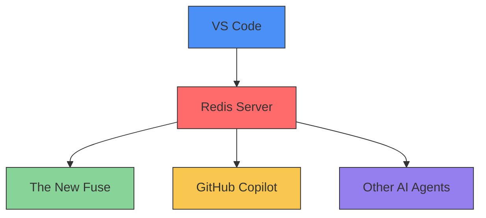

# The New Fuse: Comprehensive Guide

## Core Philosophy

The New Fuse emphasizes **practical implementation** over documentation upgrades. Key principles:
- Every workflow must include validation checkpoints matching execute-workflow.js parameters
- All examples should be directly executable with current Redis configuration
- Script parameters enforce production readiness checks
- Documentation changes require corresponding code updates

This guide provides detailed instructions on how to use The New Fuse extension with GitHub Copilot and other AI agents to create powerful collaborative workflows.

## Table of Contents

1. [Prerequisites](#prerequisites)
2. [Activation](#activation)
3. [Basic Usage](#basic-usage)
4. [Creating Workflows](#creating-workflows)
5. [Advanced Workflows](#advanced-workflows)
6. [Troubleshooting](#troubleshooting)
7. [Scripts Reference](#scripts-reference)

## Prerequisites

Before you begin, ensure you have the following:

- VS Code 1.89+ installed
- The New Fuse extension v1.2.0+ installed (`thenewfuse.the-new-fuse`)
- GitHub Copilot extension v1.123.456+ installed (`github.copilot`)
- Redis server 7.2.4+ running on port 6379

Verification commands:
```bash
# Check extension versions
code --list-extensions --show-versions | grep -E 'fuse|copilot'

# Verify Redis version
redis-server --version
```

You can verify these prerequisites with the following commands:

```bash
# Check installed extensions
code --list-extensions | grep -E 'fuse|copilot'

# Check if Redis server is running
ps aux | grep redis
```

## Activation

To activate The New Fuse extension and establish communication with other AI agents:

1. Open VS Code Command Palette (Cmd+Shift+P on Mac, Ctrl+Shift+P on Windows/Linux)
2. Run `The New Fuse: Show Discovered AI Agents`
3. Run `The New Fuse: Refresh Agent Discovery`
4. Run `The New Fuse: Open Workflow Builder`

Alternatively, you can use the provided scripts:

```bash
# Show discovered agents
node show-agents.js

# Refresh agent discovery
node refresh-agents.js

# Open workflow builder
node open-workflow-builder.js
```

## Basic Usage

### Discovering AI Agents

The New Fuse automatically discovers AI-capable extensions in your VS Code environment. You can view the discovered agents by running:

```
The New Fuse: Show Discovered AI Agents
```

This will display a list of discovered agents, including:
- GitHub Copilot
- Claude (if installed)
- Roo Cline (if installed)
- Other AI-capable extensions

### Agent Status

The workflow builder includes a status bar that shows the number of connected agents. Agents can be in one of two states:
- Online: The agent is active and available for use in workflows
- Offline: The agent is installed but not currently active

You can refresh agent discovery by clicking the "Refresh Agents" button in the status bar.

## Creating Workflows

### Basic Workflow Structure

A workflow consists of:
- Steps: Individual tasks performed by AI agents
- Connections: Data flow between steps

### Creating a Simple Workflow

1.  Open the workflow builder.
2.  Click "New Workflow".
3.  Add a step by dragging a step type from the sidebar onto the canvas.  Consider starting with a "Code Generation" or "Text Generation" step.
4.  Configure the step by selecting an agent (e.g., GitHub Copilot, Claude) and setting the inputs.  Pay close attention to the required input parameters for the selected agent.
5.  Add additional steps as needed to create a multi-step workflow.
6.  Connect steps by dragging from an output port on one step to an input port on another step.  Ensure the data types are compatible between the output and input.
7.  Save the workflow, giving it a descriptive name.
8.  Execute the workflow.  Monitor the VS Code output panel for progress and any error messages.

### Workflow Examples

**Multi-Agent Code Review Workflow:**
```json
{
  "name": "AI Code Review",
  "schemaVersion": "1.2.0",
  "validation": {
    "requiredAgents": ["github.copilot", "claude", "thefuse.main"],
    "redisChecks": {
      "requiredChannels": ["workflow-events", "agent-coordination"],
      "maxLatency": 500,
      "redisConnectionTimeout": 3000,
      "minRedisVersion": "7.2.4",
      "pubSubLatencyChecks": true
    }
  },
  "steps": [
    {
      "id": "copilot-gen",
      "type": "code-generation",
      "agent": "GitHub Copilot",
      "inputs": {
        "prompt": "Implement user authentication middleware using JWT"
      },
      "outputMappings": {
        "code": {
          "validation": "typeof code === 'string' && code.length > 0",
          "error": "Generated code must be non-empty string"
        }
      }
    },
    {
      "id": "claude-audit",
      "type": "code-analysis",
      "agent": "Claude",
      "dependencies": ["copilot-gen"],
      "inputs": {
        "code": "${copilot-gen.outputs.code}"
      },
      "params": {
        "analysis_type": "security",
        "strict_mode": true
      },
      "redisEvents": {
        "onStart": "security-analysis-start",
        "onComplete": "security-analysis-complete"
      }
    },
    {
      "id": "fuse-validate",
      "type": "error-checking",
      "agent": "The New Fuse",
      "dependencies": ["copilot-gen", "claude-audit"],
      "inputs": {
        "code": "${copilot-gen.outputs.code}",
        "feedback": "${claude-audit.outputs.analysis}"
      },
      "validationRules": {
        "maxErrors": 3,
        "allowedSeverities": ["critical", "high"]
      }
    }
  ],
  "redisListeners": [
    {
      "channel": "workflow-events",
      "handler": "logWorkflowProgress"
    },
    {
      "channel": "agent-coordination",
      "handler": "handleAgentMessages"
    }
  ]
}
```

### Example: Code Generation Workflow

Here's a simple workflow that generates code with GitHub Copilot and explains it with The New Fuse:

1. Add a "Code Generation" step
   - Agent: GitHub Copilot
   - Input: Prompt = "Write a function to calculate the Fibonacci sequence"
   - Output: Code

2. Add a "Code Explanation" step
   - Agent: The New Fuse
   - Input: Code = ${steps.1.outputs.code}
   - Output: Explanation

3. Connect the steps by dragging from the "Code" output of step 1 to the "Code" input of step 2

4. Save and execute the workflow

## Advanced Workflows

### Multi-Agent Collaboration

You can create complex workflows involving multiple AI agents working together:

1. **Requirements Gathering**: Use The New Fuse to generate requirements
2. **Architecture Design**: Use GitHub Copilot to design system architecture
3. **API Generation**: Use Claude to generate API specifications
4. **Implementation**: Use GitHub Copilot and Roo Cline to implement backend and frontend
5. **Testing**: Use The New Fuse to generate tests
6. **Optimization**: Use GitHub Copilot to review and optimize code

### Workflow Templates

We've provided sample workflow templates in the `workflows` directory:

- `copilot-collaboration.json`: A simple workflow demonstrating collaboration between The New Fuse and GitHub Copilot
- `advanced-ai-collaboration.json`: A complex workflow demonstrating collaboration between multiple AI agents

You can execute these workflows using the `execute-workflow.js` script which now includes:
- Workflow structure validation
- Redis connection monitoring
- Real-time execution events

```bash
node execute-workflow.js workflows/copilot-collaboration.json

# Monitor workflow events:
redis-cli --csv psubscribe '__keyspace@0__:workflow-events'

# View validation errors:
node execute-workflow.js invalid-workflow.json 2> validation-errors.log
```

### Custom Workflow Creation

You can create custom workflows by:

1. Using the workflow builder UI
2. Creating workflow JSON files manually
3. Using the `create-collaborative-workflow.js` script

## Troubleshooting

### Common Issues

1. **Agent Not Discovered**
   - Confirm extension is enabled in VS Code extensions panel
   - Verify extension meets minimum version requirements
   - Run `The New Fuse: Reset Agent Discovery` command

2. **Redis Communication Errors**
   - Test Redis connection: `redis-cli -h 127.0.0.1 -p 6379 PING`
   - Check Redis logs: `tail -n 100 /usr/local/var/log/redis.log`
   - Verify pub/sub channels: `node scripts/monitor_channels.js`
   - Reset connection: `node scripts/fix-redis-issues.sh --reset`

3. **Workflow Version Conflicts**
   - Check workflow schema version in JSON metadata
   - Run schema migration: `node scripts/migrate-workflow.js <file>`
   - Validate workflow: `node scripts/validate-workflow.js <file>`



3. **Workflow Execution Fails**
   - Check that all required agents are online
   - Verify workflow connections are correct
   - Check input/output parameter names

### Logs and Debugging

You can view The New Fuse logs by running:

```
The New Fuse: Show Log
```

## Scripts Reference

We've provided several scripts to help you use The New Fuse:

- `show-agents.js`: Shows discovered AI agents
- `refresh-agents.js`: Refreshes agent discovery
- `open-workflow-builder.js`: Opens the workflow builder
- `create-collaborative-workflow.js`: Creates a sample collaborative workflow
- `execute-workflow.js`: Executes workflows with Redis monitoring and validation including:
  - redisConnectionTimeout (3000ms default)
  - minRedisVersion (7.2.4)
  - pubSubLatencyChecks (true)
  - redisConnectionTimeout
  - minRedisVersion
  - pubSubLatencyChecks:
  - redisConnectionTimeout
  - minRedisVersion
  - pubSubLatencyChecks:
  - Validates workflow structure
  - Verifies Redis connectivity
  - Publishes real-time execution events
  - Handles multi-agent coordination errors
- `fix-redis-issues.sh`: Troubleshoot Redis configuration
- `monitor_channels.sh`: Monitor Redis pub/sub channels
- `setup-extension.sh`: Complete extension setup
- `direct-launch.sh`: Fast launch configuration

These scripts require the VS Code API to be available and should be run in a JavaScript Debug Terminal within VS Code.

---

With this guide, you should be able to use The New Fuse extension to its full potential, creating powerful collaborative workflows between different AI agents in VS Code.
